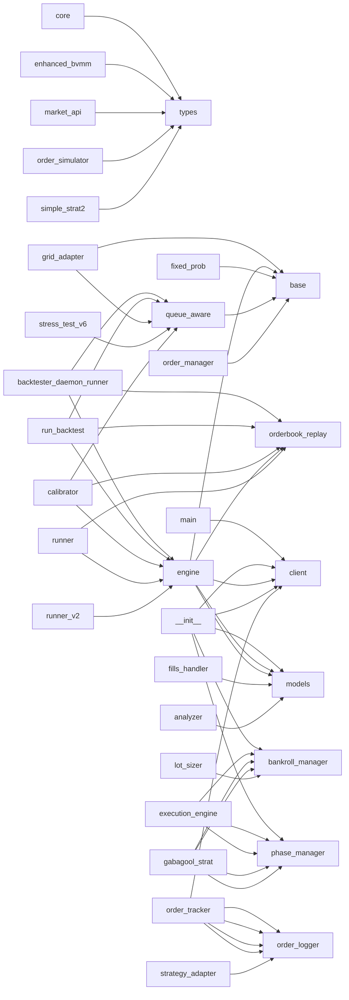

# Import Graph

## Mermaid diagram (top hubs only)

## Forward dependencies (X imports → Y)

### `analysis/core/__init__.py` [UTIL]
- → `tbot_integration/core/bot_selector.py`
- → `tbot_integration/core/epoch_tracker.py`
- → `tbot_integration/core/metrics.py`
- → `tbot_integration/core/parser.py`

### `analysis/core/bot_selector.py` [UTIL]
- → `tbot_integration/core/bot_selector.py`

### `analysis/core/epoch_tracker.py` [UTIL]
- → `tbot_integration/core/epoch_tracker.py`

### `analysis/core/metrics.py` [UTIL]
- → `tbot_integration/core/metrics.py`

### `analysis/core/parser.py` [UTIL]
- → `tbot_integration/core/parser.py`

### `analysis/exports/__init__.py` [UTIL]
- → `analysis/exports/tableau_csv.py`

### `analysis/signals/__init__.py` [UTIL]
- → `analysis/signals/alpha_signals.py`

### `analysis/views/__init__.py` [UTIL]
- → `analysis/views/edge_view.py`
- → `analysis/views/leaderboard.py`
- → `analysis/views/pair_state_view.py`
- → `analysis/views/quoting_health.py`
- → `analysis/views/regime_view.py`
- → `analysis/views/toxic_view.py`

### `analysis/views/toxic_view.py` [TRANSPORT]
- → `analysis/core/metrics.py`

### `archive/dead_2026-03-04/backtester_daemon_runner.py` [PLATFORM]
- → `archive/hesoyam_with_fill_rate_limits/backtester/configs/test_configs.py`
- → `archive/hesoyam_with_fill_rate_limits/backtester/core/engine.py`
- → `archive/hesoyam_with_fill_rate_limits/backtester/core/orderbook_replay.py`
- → `archive/hesoyam_with_fill_rate_limits/backtester/models/queue_aware.py`
- → `archive/hesoyam_with_fill_rate_limits/backtester/reporting/report.py`

### `archive/dead_2026-03-04/backtester_scripts/run_backtest.py` [PLATFORM]
- → `archive/hesoyam_with_fill_rate_limits/backtester/configs/test_configs.py`
- → `archive/hesoyam_with_fill_rate_limits/backtester/core/engine.py`
- → `archive/hesoyam_with_fill_rate_limits/backtester/core/orderbook_replay.py`
- → `archive/hesoyam_with_fill_rate_limits/backtester/models/fixed_prob.py`
- → `archive/hesoyam_with_fill_rate_limits/backtester/models/queue_aware.py`
- → `archive/hesoyam_with_fill_rate_limits/backtester/reporting/report.py`
- → `archive/hesoyam_with_fill_rate_limits/backtester/strategy/strategy_sim.py`

### `archive/dead_2026-03-04/backup_2026-02-07_1726/main.py` [PLATFORM]
- → `archive/dead_2026-03-04/backup_2026-02-07_1726/tbot_core/api/client.py`
- → `archive/dead_2026-03-04/backup_2026-02-07_1726/tbot_core/engine.py`
- → `archive/hesoyam_with_fill_rate_limits/tbot_integration/live_trading_bridge.py`
- → `archive/hesoyam_with_fill_rate_limits/tbot_logger/orderbook_logger.py`

### `archive/dead_2026-03-04/backup_2026-02-07_1726/orderbook_logger.py` [PLATFORM]
- → `archive/dead_2026-03-04/backup_2026-02-07_1726/tbot_core/api/ws_client.py`

### `archive/dead_2026-03-04/backup_2026-02-07_1726/tbot_core/api/__init__.py` [PLATFORM]
- → `archive/dead_2026-03-04/backup_2026-02-07_1726/tbot_core/api/client.py`
- → `archive/dead_2026-03-04/backup_2026-02-07_1726/tbot_core/api/models.py`
- → `archive/dead_2026-03-04/backup_2026-02-07_1726/tbot_core/api/signing.py`
- → `archive/dead_2026-03-04/backup_2026-02-07_1726/tbot_core/api/ws_client.py`
- → `archive/dead_2026-03-04/backup_2026-02-07_1726/tbot_core/api/ws_user_client.py`

### `archive/dead_2026-03-04/backup_2026-02-07_1726/tbot_core/api/client.py` [PLATFORM]
- → `archive/dead_2026-03-04/backup_2026-02-07_1726/tbot_core/api/signing.py`

### `archive/dead_2026-03-04/backup_2026-02-07_1726/tbot_core/engine.py` [PLATFORM]
- → `archive/dead_2026-03-04/backup_2026-02-07_1726/tbot_core/api/client.py`
- → `archive/dead_2026-03-04/backup_2026-02-07_1726/tbot_core/api/models.py`
- → `archive/dead_2026-03-04/backup_2026-02-07_1726/tbot_core/api/ws_client.py`
- → `archive/dead_2026-03-04/backup_2026-02-07_1726/tbot_core/api/ws_user_client.py`
- → `archive/dead_2026-03-04/backup_2026-02-07_1726/tbot_core/execution/claim_manager.py`
- → `archive/dead_2026-03-04/backup_2026-02-07_1726/tbot_core/execution/fills_handler.py`
- → `archive/dead_2026-03-04/backup_2026-02-07_1726/tbot_core/execution/manager.py`
- → `archive/dead_2026-03-04/backup_2026-02-07_1726/tbot_core/execution/position_tracker.py`
- → `archive/dead_2026-03-04/backup_2026-02-07_1726/tbot_core/market/analyzer.py`
- → `archive/dead_2026-03-04/backup_2026-02-07_1726/tbot_core/strategy/core.py`
- → `archive/dead_2026-03-04/backup_2026-02-07_1726/tbot_risk/guards.py`
- → `archive/dead_2026-03-04/backup_2026-02-07_1726/tbot_risk/limits.py`

### `archive/dead_2026-03-04/backup_2026-02-07_1726/tbot_core/execution/fills_handler.py` [TRANSPORT]
- → `archive/dead_2026-03-04/backup_2026-02-07_1726/tbot_core/api/models.py`

### `archive/dead_2026-03-04/backup_2026-02-07_1726/tbot_core/market/analyzer.py` [TRANSPORT]
- → `archive/dead_2026-03-04/backup_2026-02-07_1726/tbot_core/api/models.py`

### `archive/dead_2026-03-04/backup_2026-02-07_1726/tbot_core/strategy/core.py` [PLATFORM]
- → `archive/dead_2026-03-04/backup_2026-02-07_1726/tbot_core/strategy/types.py`

### `archive/dead_2026-03-04/backup_2026-02-07_1726/tbot_core/strategy/enhanced_bvmm.py` [PLATFORM]
- → `archive/dead_2026-03-04/backup_2026-02-07_1726/tbot_core/strategy/core.py`
- → `archive/dead_2026-03-04/backup_2026-02-07_1726/tbot_core/strategy/log_reader.py`
- → `archive/dead_2026-03-04/backup_2026-02-07_1726/tbot_core/strategy/order_simulator.py`
- → `archive/dead_2026-03-04/backup_2026-02-07_1726/tbot_core/strategy/types.py`

### `archive/dead_2026-03-04/backup_2026-02-07_1726/tbot_core/strategy/log_reader.py` [PLATFORM]
- → `archive/hesoyam_with_fill_rate_limits/tbot_core/infrastructure/market_structure.py`

### `archive/dead_2026-03-04/backup_2026-02-07_1726/tbot_core/strategy/market_api.py` [PLATFORM]
- → `archive/dead_2026-03-04/backup_2026-02-07_1726/tbot_core/strategy/types.py`

### `archive/dead_2026-03-04/backup_2026-02-07_1726/tbot_core/strategy/order_simulator.py` [CORE]
- → `archive/dead_2026-03-04/backup_2026-02-07_1726/tbot_core/strategy/types.py`

### `archive/dead_2026-03-04/backup_2026-02-07_1726/tbot_core/strategy/simple_strat2.py` [TRANSPORT]
- → `archive/dead_2026-03-04/backup_2026-02-07_1726/tbot_core/strategy/core.py`
- → `archive/dead_2026-03-04/backup_2026-02-07_1726/tbot_core/strategy/types.py`

### `archive/dead_2026-03-04/grid_adapter.py` [PLATFORM]
- → `archive/hesoyam_with_fill_rate_limits/backtester/models/base.py`
- → `archive/hesoyam_with_fill_rate_limits/backtester/models/queue_aware.py`
- → `strategies/gabagool/execution_engine_v6.py`
- → `strategies/gabagool/grid_manager.py`
- → `strategies/gabagool/grid_strategy.py`

### `archive/dead_2026-03-04/market_api.py` [PLATFORM]
- → `archive/dead_2026-03-04/backup_2026-02-07_1726/tbot_core/strategy/types.py`

### `archive/dead_2026-03-04/polymarket/__init__.py` [PLATFORM]
- → `archive/dead_2026-03-04/backup_2026-02-07_1726/tbot_core/api/client.py`
- → `archive/dead_2026-03-04/polymarket/order_tracker.py`
- → `archive/dead_2026-03-04/polymarket/position_sync.py`

### `archive/dead_2026-03-04/polymarket/order_tracker.py` [PLATFORM]
- → `archive/dead_2026-03-04/backup_2026-02-07_1726/tbot_core/api/client.py`
- → `archive/hesoyam_with_fill_rate_limits/strategies/gabagool/order_logger.py`

### `archive/dead_2026-03-04/polymarket/position_sync.py` [PLATFORM]
- → `archive/dead_2026-03-04/backup_2026-02-07_1726/tbot_core/api/client.py`

### `archive/dead_2026-03-04/recovery_module_v6.py` [PLATFORM]
- → `strategies/gabagool/grid_manager.py`

### `archive/dead_2026-03-04/risk_manager.py` [TRANSPORT]
- → `archive/hesoyam_with_fill_rate_limits/tbot_integration/telegram_alerts.py`

### `archive/dead_2026-03-04/run_logger.py` [PLATFORM]
- → `archive/hesoyam_with_fill_rate_limits/tbot_logger/orderbook_logger.py`

### `archive/dead_2026-03-04/run_strategy.py` [CORE]
- → `archive/dead_2026-03-04/backup_2026-02-07_1726/tbot_core/api/market_api.py`
- → `archive/dead_2026-03-04/backup_2026-02-07_1726/tbot_core/strategy/enhanced_bvmm.py`

### `archive/dead_2026-03-04/show_market.py` [UTIL]
- → `archive/hesoyam_with_fill_rate_limits/tbot_logger/orderbook_logger.py`

### `archive/dead_2026-03-04/stress_test_v6.py` [PLATFORM]
- → `archive/hesoyam_with_fill_rate_limits/backtester/models/queue_aware.py`
- → `backtester/core/engine_v6.py`
- → `backtester/strategy/grid_strategy_sim.py`

### `archive/dead_2026-03-04/tbot_core_execution/fills_handler.py` [TRANSPORT]
- → `archive/dead_2026-03-04/backup_2026-02-07_1726/tbot_core/api/models.py`

### `archive/dead_2026-03-04/tbot_core_market/analyzer.py` [TRANSPORT]
- → `archive/dead_2026-03-04/backup_2026-02-07_1726/tbot_core/api/models.py`

### `archive/dead_2026-03-04/test_live_order_direct.py` [PLATFORM]
- → `archive/hesoyam_with_fill_rate_limits/tbot_logger/ws_client.py`

### `archive/dead_2026-03-04/test_live_order_ws.py` [PLATFORM]
- → `archive/hesoyam_with_fill_rate_limits/tbot_logger/ws_client.py`

### `archive/hesoyam_with_fill_rate_limits/backtester/calibration/calibrator.py` [TRANSPORT]
- → `archive/hesoyam_with_fill_rate_limits/backtester/core/engine.py`
- → `archive/hesoyam_with_fill_rate_limits/backtester/core/orderbook_replay.py`
- → `archive/hesoyam_with_fill_rate_limits/backtester/models/queue_aware.py`
- → `archive/hesoyam_with_fill_rate_limits/backtester/strategy/strategy_sim.py`

### `archive/hesoyam_with_fill_rate_limits/backtester/configs/market_configs.py` [CORE]
- → `archive/hesoyam_with_fill_rate_limits/backtester/configs/test_configs.py`

### `archive/hesoyam_with_fill_rate_limits/backtester/configs/test_configs.py` [PLATFORM]
- → `archive/hesoyam_with_fill_rate_limits/backtester/strategy/strategy_sim.py`

### `archive/hesoyam_with_fill_rate_limits/backtester/core/engine.py` [PLATFORM]
- → `archive/hesoyam_with_fill_rate_limits/backtester/core/orderbook_replay.py`
- → `archive/hesoyam_with_fill_rate_limits/backtester/models/base.py`
- → `archive/hesoyam_with_fill_rate_limits/backtester/strategy/strategy_sim.py`

### `archive/hesoyam_with_fill_rate_limits/backtester/daemon/runner.py` [PLATFORM]
- → `archive/hesoyam_with_fill_rate_limits/backtester/configs/test_configs.py`
- → `archive/hesoyam_with_fill_rate_limits/backtester/core/engine.py`
- → `archive/hesoyam_with_fill_rate_limits/backtester/core/orderbook_replay.py`
- → `archive/hesoyam_with_fill_rate_limits/backtester/models/queue_aware.py`
- → `archive/hesoyam_with_fill_rate_limits/backtester/reporting/report.py`

### `archive/hesoyam_with_fill_rate_limits/backtester/daemon/runner_v2.py` [PLATFORM]
- → `archive/hesoyam_with_fill_rate_limits/backtester/configs/market_configs.py`
- → `archive/hesoyam_with_fill_rate_limits/backtester/core/engine.py`
- → `archive/hesoyam_with_fill_rate_limits/backtester/core/orderbook_replay.py`
- → `archive/hesoyam_with_fill_rate_limits/backtester/models/queue_aware.py`
- → `archive/hesoyam_with_fill_rate_limits/backtester/reporting/report.py`
- → `archive/hesoyam_with_fill_rate_limits/backtester/results_db.py`

### `archive/hesoyam_with_fill_rate_limits/backtester/models/fixed_prob.py` [CORE]
- → `archive/hesoyam_with_fill_rate_limits/backtester/models/base.py`

### `archive/hesoyam_with_fill_rate_limits/backtester/models/queue_aware.py` [TRANSPORT]
- → `archive/hesoyam_with_fill_rate_limits/backtester/models/base.py`

### `archive/hesoyam_with_fill_rate_limits/backtester/scripts/run_backtest.py` [PLATFORM]
- → `archive/hesoyam_with_fill_rate_limits/backtester/configs/test_configs.py`
- → `archive/hesoyam_with_fill_rate_limits/backtester/core/engine.py`
- → `archive/hesoyam_with_fill_rate_limits/backtester/core/orderbook_replay.py`
- → `archive/hesoyam_with_fill_rate_limits/backtester/models/fixed_prob.py`
- → `archive/hesoyam_with_fill_rate_limits/backtester/models/queue_aware.py`
- → `archive/hesoyam_with_fill_rate_limits/backtester/reporting/report.py`
- → `archive/hesoyam_with_fill_rate_limits/backtester/strategy/strategy_sim.py`

### `archive/hesoyam_with_fill_rate_limits/backtester/strategy/order_manager.py` [CORE]
- → `archive/hesoyam_with_fill_rate_limits/backtester/models/base.py`

### `archive/hesoyam_with_fill_rate_limits/backtester/strategy/position_tracker.py` [PLATFORM]
- → `archive/hesoyam_with_fill_rate_limits/backtester/models/base.py`

### `archive/hesoyam_with_fill_rate_limits/backtester/strategy/strategy_sim.py` [PLATFORM]
- → `archive/hesoyam_with_fill_rate_limits/backtester/core/clock.py`
- → `archive/hesoyam_with_fill_rate_limits/backtester/models/base.py`
- → `archive/hesoyam_with_fill_rate_limits/backtester/strategy/order_manager.py`
- → `archive/hesoyam_with_fill_rate_limits/backtester/strategy/position_tracker.py`

### `archive/hesoyam_with_fill_rate_limits/main.py` [PLATFORM]
- → `archive/dead_2026-03-04/backup_2026-02-07_1726/tbot_core/api/client.py`
- → `archive/dead_2026-03-04/backup_2026-02-07_1726/tbot_core/engine.py`
- → `archive/hesoyam_with_fill_rate_limits/tbot_integration/live_trading_bridge.py`
- → `archive/hesoyam_with_fill_rate_limits/tbot_integration/telegram_alerts.py`
- → `archive/hesoyam_with_fill_rate_limits/tbot_logger/orderbook_logger.py`

### `archive/hesoyam_with_fill_rate_limits/polymarket/__init__.py` [PLATFORM]
- → `archive/dead_2026-03-04/backup_2026-02-07_1726/tbot_core/api/client.py`
- → `archive/dead_2026-03-04/polymarket/order_tracker.py`
- → `archive/dead_2026-03-04/polymarket/position_sync.py`

### `archive/hesoyam_with_fill_rate_limits/polymarket/order_tracker.py` [PLATFORM]
- → `archive/dead_2026-03-04/backup_2026-02-07_1726/tbot_core/api/client.py`
- → `archive/hesoyam_with_fill_rate_limits/strategies/gabagool/order_logger.py`

### `archive/hesoyam_with_fill_rate_limits/polymarket/position_sync.py` [PLATFORM]
- → `archive/dead_2026-03-04/backup_2026-02-07_1726/tbot_core/api/client.py`

### `archive/hesoyam_with_fill_rate_limits/run_strategy.py` [CORE]
- → `archive/dead_2026-03-04/backup_2026-02-07_1726/tbot_core/api/market_api.py`
- → `archive/dead_2026-03-04/backup_2026-02-07_1726/tbot_core/strategy/enhanced_bvmm.py`

### `archive/hesoyam_with_fill_rate_limits/show_market.py` [UTIL]
- → `archive/hesoyam_with_fill_rate_limits/tbot_logger/orderbook_logger.py`

### `archive/hesoyam_with_fill_rate_limits/strategies/gabagool/__init__.py` [UTIL]
- → `archive/dead_2026-03-04/risk_manager.py`
- → `archive/hesoyam_with_fill_rate_limits/strategies/gabagool/bankroll_manager.py`
- → `archive/hesoyam_with_fill_rate_limits/strategies/gabagool/execution_engine.py`
- → `archive/hesoyam_with_fill_rate_limits/strategies/gabagool/gabagool_strat.py`
- → `archive/hesoyam_with_fill_rate_limits/strategies/gabagool/linked_orders.py`
- → `archive/hesoyam_with_fill_rate_limits/strategies/gabagool/lot_sizer.py`
- → `archive/hesoyam_with_fill_rate_limits/strategies/gabagool/opportunity_evaluator.py`
- → `archive/hesoyam_with_fill_rate_limits/strategies/gabagool/order_pricer.py`
- → `archive/hesoyam_with_fill_rate_limits/strategies/gabagool/phase_manager.py`
- → `archive/hesoyam_with_fill_rate_limits/strategies/gabagool/rebalancer.py`
- → `archive/hesoyam_with_fill_rate_limits/strategies/gabagool/results_tracker.py`

### `archive/hesoyam_with_fill_rate_limits/strategies/gabagool/execution_engine.py` [TRANSPORT]
- → `archive/hesoyam_with_fill_rate_limits/strategies/gabagool/bankroll_manager.py`
- → `archive/hesoyam_with_fill_rate_limits/strategies/gabagool/lot_sizer.py`
- → `archive/hesoyam_with_fill_rate_limits/strategies/gabagool/order_pricer.py`
- → `archive/hesoyam_with_fill_rate_limits/strategies/gabagool/phase_manager.py`

### `archive/hesoyam_with_fill_rate_limits/strategies/gabagool/gabagool_strat.py` [PLATFORM]
- → `archive/dead_2026-03-04/risk_manager.py`
- → `archive/hesoyam_with_fill_rate_limits/strategies/gabagool/bankroll_manager.py`
- → `archive/hesoyam_with_fill_rate_limits/strategies/gabagool/execution_engine.py`
- → `archive/hesoyam_with_fill_rate_limits/strategies/gabagool/linked_orders.py`
- → `archive/hesoyam_with_fill_rate_limits/strategies/gabagool/lot_sizer.py`
- → `archive/hesoyam_with_fill_rate_limits/strategies/gabagool/opportunity_evaluator.py`
- → `archive/hesoyam_with_fill_rate_limits/strategies/gabagool/order_pricer.py`
- → `archive/hesoyam_with_fill_rate_limits/strategies/gabagool/phase_manager.py`
- → `archive/hesoyam_with_fill_rate_limits/strategies/gabagool/price_filter.py`
- → `archive/hesoyam_with_fill_rate_limits/strategies/gabagool/rebalancer.py`
- → `archive/hesoyam_with_fill_rate_limits/strategies/gabagool/recovery_module.py`
- → `archive/hesoyam_with_fill_rate_limits/strategies/gabagool/results_tracker.py`

### `archive/hesoyam_with_fill_rate_limits/strategies/gabagool/lot_sizer.py` [PLATFORM]
- → `archive/hesoyam_with_fill_rate_limits/strategies/gabagool/bankroll_manager.py`
- → `archive/hesoyam_with_fill_rate_limits/strategies/gabagool/phase_manager.py`

### `archive/hesoyam_with_fill_rate_limits/strategies/gabagool/opportunity_evaluator.py` [PLATFORM]
- → `archive/hesoyam_with_fill_rate_limits/strategies/gabagool/phase_manager.py`

### `archive/hesoyam_with_fill_rate_limits/strategies/gabagool/rebalancer.py` [PLATFORM]
- → `archive/hesoyam_with_fill_rate_limits/strategies/gabagool/bankroll_manager.py`

### `archive/hesoyam_with_fill_rate_limits/strategies/gabagool/risk_manager.py` [TRANSPORT]
- → `archive/hesoyam_with_fill_rate_limits/tbot_integration/telegram_alerts.py`

### `archive/hesoyam_with_fill_rate_limits/tbot_core/api/__init__.py` [PLATFORM]
- → `archive/dead_2026-03-04/backup_2026-02-07_1726/tbot_core/api/client.py`
- → `archive/dead_2026-03-04/backup_2026-02-07_1726/tbot_core/api/models.py`
- → `archive/dead_2026-03-04/backup_2026-02-07_1726/tbot_core/api/signing.py`
- → `archive/dead_2026-03-04/backup_2026-02-07_1726/tbot_core/api/ws_client.py`
- → `archive/dead_2026-03-04/backup_2026-02-07_1726/tbot_core/api/ws_user_client.py`

### `archive/hesoyam_with_fill_rate_limits/tbot_core/api/client.py` [PLATFORM]
- → `archive/dead_2026-03-04/backup_2026-02-07_1726/tbot_core/api/signing.py`

### `archive/hesoyam_with_fill_rate_limits/tbot_core/engine.py` [PLATFORM]
- → `archive/dead_2026-03-04/backup_2026-02-07_1726/tbot_core/api/client.py`
- → `archive/dead_2026-03-04/backup_2026-02-07_1726/tbot_core/api/models.py`
- → `archive/dead_2026-03-04/backup_2026-02-07_1726/tbot_core/api/ws_client.py`
- → `archive/dead_2026-03-04/backup_2026-02-07_1726/tbot_core/api/ws_user_client.py`
- → `archive/dead_2026-03-04/backup_2026-02-07_1726/tbot_core/execution/claim_manager.py`
- → `archive/dead_2026-03-04/backup_2026-02-07_1726/tbot_core/execution/fills_handler.py`
- → `archive/dead_2026-03-04/backup_2026-02-07_1726/tbot_core/execution/manager.py`
- → `archive/dead_2026-03-04/backup_2026-02-07_1726/tbot_core/execution/position_tracker.py`
- → `archive/dead_2026-03-04/backup_2026-02-07_1726/tbot_core/market/analyzer.py`
- → `archive/dead_2026-03-04/backup_2026-02-07_1726/tbot_core/strategy/core.py`
- → `archive/dead_2026-03-04/backup_2026-02-07_1726/tbot_risk/guards.py`
- → `archive/dead_2026-03-04/backup_2026-02-07_1726/tbot_risk/limits.py`

### `archive/hesoyam_with_fill_rate_limits/tbot_core/execution/fills_handler.py` [TRANSPORT]
- → `archive/dead_2026-03-04/backup_2026-02-07_1726/tbot_core/api/models.py`

### `archive/hesoyam_with_fill_rate_limits/tbot_core/market/analyzer.py` [TRANSPORT]
- → `archive/dead_2026-03-04/backup_2026-02-07_1726/tbot_core/api/models.py`

### `archive/hesoyam_with_fill_rate_limits/tbot_core/strategy/core.py` [PLATFORM]
- → `archive/dead_2026-03-04/backup_2026-02-07_1726/tbot_core/strategy/types.py`

### `archive/hesoyam_with_fill_rate_limits/tbot_core/strategy/enhanced_bvmm.py` [PLATFORM]
- → `archive/dead_2026-03-04/backup_2026-02-07_1726/tbot_core/strategy/core.py`
- → `archive/dead_2026-03-04/backup_2026-02-07_1726/tbot_core/strategy/log_reader.py`
- → `archive/dead_2026-03-04/backup_2026-02-07_1726/tbot_core/strategy/order_simulator.py`
- → `archive/dead_2026-03-04/backup_2026-02-07_1726/tbot_core/strategy/types.py`

### `archive/hesoyam_with_fill_rate_limits/tbot_core/strategy/log_reader.py` [PLATFORM]
- → `archive/hesoyam_with_fill_rate_limits/tbot_core/infrastructure/market_structure.py`

### `archive/hesoyam_with_fill_rate_limits/tbot_core/strategy/market_api.py` [PLATFORM]
- → `archive/dead_2026-03-04/backup_2026-02-07_1726/tbot_core/strategy/types.py`

### `archive/hesoyam_with_fill_rate_limits/tbot_core/strategy/order_simulator.py` [CORE]
- → `archive/dead_2026-03-04/backup_2026-02-07_1726/tbot_core/strategy/types.py`

### `archive/hesoyam_with_fill_rate_limits/tbot_core/strategy/simple_strat2.py` [TRANSPORT]
- → `archive/dead_2026-03-04/backup_2026-02-07_1726/tbot_core/strategy/core.py`
- → `archive/dead_2026-03-04/backup_2026-02-07_1726/tbot_core/strategy/types.py`

### `archive/hesoyam_with_fill_rate_limits/tbot_integration/backup_2026-02-07_1726/main.py` [PLATFORM]
- → `archive/dead_2026-03-04/backup_2026-02-07_1726/tbot_core/api/client.py`
- → `archive/dead_2026-03-04/backup_2026-02-07_1726/tbot_core/engine.py`
- → `archive/hesoyam_with_fill_rate_limits/tbot_integration/live_trading_bridge.py`
- → `archive/hesoyam_with_fill_rate_limits/tbot_logger/orderbook_logger.py`

### `archive/hesoyam_with_fill_rate_limits/tbot_integration/backup_2026-02-07_1726/orderbook_logger.py` [PLATFORM]
- → `archive/dead_2026-03-04/backup_2026-02-07_1726/tbot_core/api/ws_client.py`

### `archive/hesoyam_with_fill_rate_limits/tbot_integration/backup_2026-02-07_1726/tbot_core/api/__init__.py` [PLATFORM]
- → `archive/dead_2026-03-04/backup_2026-02-07_1726/tbot_core/api/client.py`
- → `archive/dead_2026-03-04/backup_2026-02-07_1726/tbot_core/api/models.py`
- → `archive/dead_2026-03-04/backup_2026-02-07_1726/tbot_core/api/signing.py`
- → `archive/dead_2026-03-04/backup_2026-02-07_1726/tbot_core/api/ws_client.py`
- → `archive/dead_2026-03-04/backup_2026-02-07_1726/tbot_core/api/ws_user_client.py`

### `archive/hesoyam_with_fill_rate_limits/tbot_integration/backup_2026-02-07_1726/tbot_core/api/client.py` [PLATFORM]
- → `archive/dead_2026-03-04/backup_2026-02-07_1726/tbot_core/api/signing.py`

### `archive/hesoyam_with_fill_rate_limits/tbot_integration/backup_2026-02-07_1726/tbot_core/engine.py` [PLATFORM]
- → `archive/dead_2026-03-04/backup_2026-02-07_1726/tbot_core/api/client.py`
- → `archive/dead_2026-03-04/backup_2026-02-07_1726/tbot_core/api/models.py`
- → `archive/dead_2026-03-04/backup_2026-02-07_1726/tbot_core/api/ws_client.py`
- → `archive/dead_2026-03-04/backup_2026-02-07_1726/tbot_core/api/ws_user_client.py`
- → `archive/dead_2026-03-04/backup_2026-02-07_1726/tbot_core/execution/claim_manager.py`
- → `archive/dead_2026-03-04/backup_2026-02-07_1726/tbot_core/execution/fills_handler.py`
- → `archive/dead_2026-03-04/backup_2026-02-07_1726/tbot_core/execution/manager.py`
- → `archive/dead_2026-03-04/backup_2026-02-07_1726/tbot_core/execution/position_tracker.py`
- → `archive/dead_2026-03-04/backup_2026-02-07_1726/tbot_core/market/analyzer.py`
- → `archive/dead_2026-03-04/backup_2026-02-07_1726/tbot_core/strategy/core.py`
- → `archive/dead_2026-03-04/backup_2026-02-07_1726/tbot_risk/guards.py`
- → `archive/dead_2026-03-04/backup_2026-02-07_1726/tbot_risk/limits.py`

### `archive/hesoyam_with_fill_rate_limits/tbot_integration/backup_2026-02-07_1726/tbot_core/execution/fills_handler.py` [TRANSPORT]
- → `archive/dead_2026-03-04/backup_2026-02-07_1726/tbot_core/api/models.py`

### `archive/hesoyam_with_fill_rate_limits/tbot_integration/backup_2026-02-07_1726/tbot_core/market/analyzer.py` [TRANSPORT]
- → `archive/dead_2026-03-04/backup_2026-02-07_1726/tbot_core/api/models.py`

### `archive/hesoyam_with_fill_rate_limits/tbot_integration/backup_2026-02-07_1726/tbot_core/strategy/core.py` [PLATFORM]
- → `archive/dead_2026-03-04/backup_2026-02-07_1726/tbot_core/strategy/types.py`

### `archive/hesoyam_with_fill_rate_limits/tbot_integration/backup_2026-02-07_1726/tbot_core/strategy/enhanced_bvmm.py` [PLATFORM]
- → `archive/dead_2026-03-04/backup_2026-02-07_1726/tbot_core/strategy/core.py`
- → `archive/dead_2026-03-04/backup_2026-02-07_1726/tbot_core/strategy/log_reader.py`
- → `archive/dead_2026-03-04/backup_2026-02-07_1726/tbot_core/strategy/order_simulator.py`
- → `archive/dead_2026-03-04/backup_2026-02-07_1726/tbot_core/strategy/types.py`

### `archive/hesoyam_with_fill_rate_limits/tbot_integration/backup_2026-02-07_1726/tbot_core/strategy/log_reader.py` [PLATFORM]
- → `archive/hesoyam_with_fill_rate_limits/tbot_core/infrastructure/market_structure.py`

### `archive/hesoyam_with_fill_rate_limits/tbot_integration/backup_2026-02-07_1726/tbot_core/strategy/market_api.py` [PLATFORM]
- → `archive/dead_2026-03-04/backup_2026-02-07_1726/tbot_core/strategy/types.py`

### `archive/hesoyam_with_fill_rate_limits/tbot_integration/backup_2026-02-07_1726/tbot_core/strategy/order_simulator.py` [CORE]
- → `archive/dead_2026-03-04/backup_2026-02-07_1726/tbot_core/strategy/types.py`

### `archive/hesoyam_with_fill_rate_limits/tbot_integration/backup_2026-02-07_1726/tbot_core/strategy/simple_strat2.py` [TRANSPORT]
- → `archive/dead_2026-03-04/backup_2026-02-07_1726/tbot_core/strategy/core.py`
- → `archive/dead_2026-03-04/backup_2026-02-07_1726/tbot_core/strategy/types.py`

### `archive/hesoyam_with_fill_rate_limits/tbot_integration/live_trading_bridge.py` [PLATFORM]
- → `archive/hesoyam_with_fill_rate_limits/tbot_integration/strategy_adapter.py`
- → `archive/hesoyam_with_fill_rate_limits/tbot_integration/strike_fetcher.py`
- → `archive/hesoyam_with_fill_rate_limits/tbot_integration/telegram_alerts.py`
- → `archive/hesoyam_with_fill_rate_limits/tbot_logger/orderbook_logger.py`

### `archive/hesoyam_with_fill_rate_limits/tbot_integration/strategy_adapter.py` [PLATFORM]
- → `archive/dead_2026-03-04/backup_2026-02-07_1726/tbot_core/api/client.py`
- → `archive/dead_2026-03-04/backup_2026-02-07_1726/tbot_core/api/signing.py`
- → `archive/dead_2026-03-04/backup_2026-02-07_1726/tbot_core/strategy/order_simulator.py`
- → `archive/hesoyam_with_fill_rate_limits/backtester/bridge/paper_bridge.py`
- → `archive/hesoyam_with_fill_rate_limits/strategies/gabagool/bankroll_manager.py`
- → `archive/hesoyam_with_fill_rate_limits/strategies/gabagool/fillrate_logger.py`
- → `archive/hesoyam_with_fill_rate_limits/strategies/gabagool/order_logger.py`
- → `archive/hesoyam_with_fill_rate_limits/tbot_integration/telegram_alerts.py`

### `archive/hesoyam_with_fill_rate_limits/tbot_logger/orderbook_logger.py` [PLATFORM]
- → `archive/dead_2026-03-04/backup_2026-02-07_1726/tbot_core/api/ws_client.py`
- → `archive/hesoyam_with_fill_rate_limits/tbot_logger/enhanced_logger.py`

### `archive/mag_knowledge/legacy/Well start here/poly_claim/bulk_redeem.py` [PLATFORM]
- → `archive/mag_knowledge/legacy/Well start here/poly_claim/ctf_core.py`

### `archive/mag_quarantine/lorine93s-analysis/src/execution/__init__.py` [UTIL]
- → `archive/mag_quarantine/lorine93s-analysis/src/execution/order_executor.py`

### `archive/mag_quarantine/lorine93s-analysis/src/execution/order_executor.py` [TRANSPORT]
- → `archive/mag_quarantine/lorine93s-analysis/src/config.py`
- → `archive/mag_quarantine/lorine93s-analysis/src/polymarket/order_signer.py`

### `archive/mag_quarantine/lorine93s-analysis/src/inventory/__init__.py` [UTIL]
- → `archive/mag_quarantine/lorine93s-analysis/src/inventory/inventory_manager.py`

### `archive/mag_quarantine/lorine93s-analysis/src/main.py` [PLATFORM]
- → `archive/mag_quarantine/lorine93s-analysis/src/config.py`
- → `archive/mag_quarantine/lorine93s-analysis/src/execution/order_executor.py`
- → `archive/mag_quarantine/lorine93s-analysis/src/inventory/inventory_manager.py`
- → `archive/mag_quarantine/lorine93s-analysis/src/logging_config.py`
- → `archive/mag_quarantine/lorine93s-analysis/src/market_maker/quote_engine.py`
- → `archive/mag_quarantine/lorine93s-analysis/src/polymarket/order_signer.py`
- → `archive/mag_quarantine/lorine93s-analysis/src/polymarket/rest_client.py`
- → `archive/mag_quarantine/lorine93s-analysis/src/polymarket/websocket_client.py`
- → `archive/mag_quarantine/lorine93s-analysis/src/risk/risk_manager.py`

### `archive/mag_quarantine/lorine93s-analysis/src/market_maker/__init__.py` [UTIL]
- → `archive/mag_quarantine/lorine93s-analysis/src/market_maker/quote_engine.py`

### `archive/mag_quarantine/lorine93s-analysis/src/market_maker/quote_engine.py` [PLATFORM]
- → `archive/mag_quarantine/lorine93s-analysis/src/config.py`
- → `archive/mag_quarantine/lorine93s-analysis/src/inventory/inventory_manager.py`

### `archive/mag_quarantine/lorine93s-analysis/src/polymarket/__init__.py` [PLATFORM]
- → `archive/mag_quarantine/lorine93s-analysis/src/polymarket/order_signer.py`
- → `archive/mag_quarantine/lorine93s-analysis/src/polymarket/rest_client.py`
- → `archive/mag_quarantine/lorine93s-analysis/src/polymarket/websocket_client.py`

### `archive/mag_quarantine/lorine93s-analysis/src/polymarket/rest_client.py` [TRANSPORT]
- → `archive/mag_quarantine/lorine93s-analysis/src/config.py`

### `archive/mag_quarantine/lorine93s-analysis/src/polymarket/websocket_client.py` [TRANSPORT]
- → `archive/mag_quarantine/lorine93s-analysis/src/config.py`

### `archive/mag_quarantine/lorine93s-analysis/src/risk/__init__.py` [UTIL]
- → `archive/mag_quarantine/lorine93s-analysis/src/risk/risk_manager.py`

### `archive/mag_quarantine/lorine93s-analysis/src/risk/risk_manager.py` [CORE]
- → `archive/mag_quarantine/lorine93s-analysis/src/config.py`
- → `archive/mag_quarantine/lorine93s-analysis/src/inventory/inventory_manager.py`

### `archive/mag_quarantine/lorine93s-analysis/src/services/__init__.py` [UTIL]
- → `archive/mag_quarantine/lorine93s-analysis/src/services/auto_redeem.py`
- → `archive/mag_quarantine/lorine93s-analysis/src/services/metrics.py`

### `archive/mag_quarantine/lorine93s-analysis/src/services/auto_redeem.py` [TRANSPORT]
- → `archive/mag_quarantine/lorine93s-analysis/src/config.py`

### `archive/optimizer/angel_optimizer.py` [TRANSPORT]
- → `archive/hesoyam_with_fill_rate_limits/backtester/configs/market_configs.py`
- → `archive/hesoyam_with_fill_rate_limits/backtester/core/engine.py`
- → `archive/hesoyam_with_fill_rate_limits/backtester/core/orderbook_replay.py`
- → `archive/hesoyam_with_fill_rate_limits/backtester/models/queue_aware.py`
- → `archive/hesoyam_with_fill_rate_limits/backtester/strategy/strategy_sim.py`

### `archive/quarantine/polymarket_repos/py-clob-client/py_clob_client/__init__.py` [UTIL]
- → `archive/dead_2026-03-04/backup_2026-02-07_1726/tbot_core/api/client.py`
- → `archive/quarantine/polymarket_repos/py-clob-client/py_clob_client/clob_types.py`

### `archive/quarantine/polymarket_repos/py-clob-client/py_clob_client/client.py` [PLATFORM]
- → `archive/mag_quarantine/lorine93s-analysis/src/config.py`
- → `archive/quarantine/polymarket_repos/py-clob-client/py_clob_client/clob_types.py`
- → `archive/quarantine/polymarket_repos/py-clob-client/py_clob_client/constants.py`
- → `archive/quarantine/polymarket_repos/py-clob-client/py_clob_client/endpoints.py`
- → `archive/quarantine/polymarket_repos/py-clob-client/py_clob_client/exceptions.py`
- → `archive/quarantine/polymarket_repos/py-clob-client/py_clob_client/headers/headers.py`
- → `archive/quarantine/polymarket_repos/py-clob-client/py_clob_client/http_helpers/helpers.py`
- → `archive/quarantine/polymarket_repos/py-clob-client/py_clob_client/order_builder/builder.py`
- → `archive/quarantine/polymarket_repos/py-clob-client/py_clob_client/signer.py`
- → `archive/quarantine/polymarket_repos/py-clob-client/py_clob_client/utilities.py`

### `archive/quarantine/polymarket_repos/py-clob-client/py_clob_client/clob_types.py` [PLATFORM]
- → `archive/quarantine/polymarket_repos/py-clob-client/py_clob_client/constants.py`

### `archive/quarantine/polymarket_repos/py-clob-client/py_clob_client/config.py` [TRANSPORT]
- → `archive/quarantine/polymarket_repos/py-clob-client/py_clob_client/clob_types.py`

### `archive/quarantine/polymarket_repos/py-clob-client/py_clob_client/headers/headers.py` [CORE]
- → `archive/quarantine/polymarket_repos/py-clob-client/py_clob_client/clob_types.py`
- → `archive/quarantine/polymarket_repos/py-clob-client/py_clob_client/signer.py`
- → `archive/quarantine/polymarket_repos/py-clob-client/py_clob_client/signing/eip712.py`
- → `archive/quarantine/polymarket_repos/py-clob-client/py_clob_client/signing/hmac.py`

### `archive/quarantine/polymarket_repos/py-clob-client/py_clob_client/http_helpers/helpers.py` [PLATFORM]
- → `archive/quarantine/polymarket_repos/py-clob-client/py_clob_client/exceptions.py`

### `archive/quarantine/polymarket_repos/py-clob-client/py_clob_client/order_builder/builder.py` [PLATFORM]
- → `archive/mag_quarantine/lorine93s-analysis/src/config.py`
- → `archive/quarantine/polymarket_repos/py-clob-client/py_clob_client/clob_types.py`
- → `archive/quarantine/polymarket_repos/py-clob-client/py_clob_client/constants.py`
- → `archive/quarantine/polymarket_repos/py-clob-client/py_clob_client/http_helpers/helpers.py`
- → `archive/quarantine/polymarket_repos/py-clob-client/py_clob_client/signer.py`

### `archive/quarantine/polymarket_repos/py-clob-client/py_clob_client/rfq/__init__.py` [UTIL]
- → `archive/quarantine/polymarket_repos/py-clob-client/py_clob_client/rfq/rfq_client.py`
- → `archive/quarantine/polymarket_repos/py-clob-client/py_clob_client/rfq/rfq_helpers.py`
- → `archive/quarantine/polymarket_repos/py-clob-client/py_clob_client/rfq/rfq_types.py`

### `archive/quarantine/polymarket_repos/py-clob-client/py_clob_client/rfq/rfq_client.py` [PLATFORM]
- → `archive/dead_2026-03-04/backup_2026-02-07_1726/tbot_core/api/client.py`
- → `archive/quarantine/polymarket_repos/py-clob-client/py_clob_client/clob_types.py`
- → `archive/quarantine/polymarket_repos/py-clob-client/py_clob_client/endpoints.py`
- → `archive/quarantine/polymarket_repos/py-clob-client/py_clob_client/headers/headers.py`
- → `archive/quarantine/polymarket_repos/py-clob-client/py_clob_client/http_helpers/helpers.py`
- → `archive/quarantine/polymarket_repos/py-clob-client/py_clob_client/order_builder/builder.py`
- → `archive/quarantine/polymarket_repos/py-clob-client/py_clob_client/order_builder/constants.py`
- → `archive/quarantine/polymarket_repos/py-clob-client/py_clob_client/order_builder/helpers.py`
- → `archive/quarantine/polymarket_repos/py-clob-client/py_clob_client/rfq/rfq_helpers.py`
- → `archive/quarantine/polymarket_repos/py-clob-client/py_clob_client/rfq/rfq_types.py`

### `archive/quarantine/polymarket_repos/py-clob-client/py_clob_client/rfq/rfq_helpers.py` [PLATFORM]
- → `archive/quarantine/polymarket_repos/py-clob-client/py_clob_client/rfq/rfq_types.py`

### `archive/quarantine/polymarket_repos/py-clob-client/py_clob_client/signing/eip712.py` [UTIL]
- → `archive/quarantine/polymarket_repos/py-clob-client/py_clob_client/signer.py`
- → `archive/quarantine/polymarket_repos/py-clob-client/py_clob_client/signing/model.py`

### `archive/quarantine/polymarket_repos/py-clob-client/py_clob_client/utilities.py` [CORE]
- → `archive/quarantine/polymarket_repos/py-clob-client/py_clob_client/clob_types.py`

### `backtester/calibration/calibrator.py` [TRANSPORT]
- → `archive/hesoyam_with_fill_rate_limits/backtester/core/engine.py`
- → `archive/hesoyam_with_fill_rate_limits/backtester/core/orderbook_replay.py`
- → `archive/hesoyam_with_fill_rate_limits/backtester/models/queue_aware.py`
- → `archive/hesoyam_with_fill_rate_limits/backtester/strategy/strategy_sim.py`

### `backtester/configs/market_configs.py` [CORE]
- → `archive/hesoyam_with_fill_rate_limits/backtester/configs/test_configs.py`

### `backtester/configs/test_configs.py` [PLATFORM]
- → `archive/hesoyam_with_fill_rate_limits/backtester/strategy/strategy_sim.py`

### `backtester/core/engine.py` [PLATFORM]
- → `archive/hesoyam_with_fill_rate_limits/backtester/core/orderbook_replay.py`
- → `archive/hesoyam_with_fill_rate_limits/backtester/models/base.py`
- → `archive/hesoyam_with_fill_rate_limits/backtester/strategy/strategy_sim.py`

### `backtester/core/engine_v6.py` [PLATFORM]
- → `archive/hesoyam_with_fill_rate_limits/backtester/core/engine.py`
- → `archive/hesoyam_with_fill_rate_limits/backtester/core/orderbook_replay.py`
- → `archive/hesoyam_with_fill_rate_limits/backtester/models/base.py`
- → `backtester/strategy/grid_strategy_sim.py`

### `backtester/daemon/runner_v2.py` [PLATFORM]
- → `archive/hesoyam_with_fill_rate_limits/backtester/configs/market_configs.py`
- → `archive/hesoyam_with_fill_rate_limits/backtester/core/engine.py`
- → `archive/hesoyam_with_fill_rate_limits/backtester/core/orderbook_replay.py`
- → `archive/hesoyam_with_fill_rate_limits/backtester/models/queue_aware.py`
- → `archive/hesoyam_with_fill_rate_limits/backtester/reporting/report.py`
- → `archive/hesoyam_with_fill_rate_limits/backtester/results_db.py`

### `backtester/daemon/runner_v3.py` [PLATFORM]
- → `archive/hesoyam_with_fill_rate_limits/backtester/configs/market_configs.py`
- → `archive/hesoyam_with_fill_rate_limits/backtester/configs/test_configs.py`
- → `archive/hesoyam_with_fill_rate_limits/backtester/core/engine.py`
- → `archive/hesoyam_with_fill_rate_limits/backtester/models/queue_aware.py`
- → `archive/hesoyam_with_fill_rate_limits/backtester/reporting/report.py`
- → `archive/hesoyam_with_fill_rate_limits/backtester/results_db.py`

### `backtester/models/fixed_prob.py` [CORE]
- → `archive/hesoyam_with_fill_rate_limits/backtester/models/base.py`

### `backtester/models/queue_aware.py` [TRANSPORT]
- → `archive/hesoyam_with_fill_rate_limits/backtester/models/base.py`

### `backtester/optimizer/deposit_scaler.py` [TRANSPORT]
- → `backtester/optimizer/param_space.py`

### `backtester/optimizer/dsr_validator.py` [TRANSPORT]
- → `archive/hesoyam_with_fill_rate_limits/backtester/models/queue_aware.py`
- → `backtester/core/engine_v6.py`
- → `backtester/optimizer/lhs_screening.py`
- → `backtester/optimizer/optuna_optimizer.py`
- → `backtester/strategy/grid_strategy_sim.py`

### `backtester/optimizer/lhs_screening.py` [TRANSPORT]
- → `archive/hesoyam_with_fill_rate_limits/backtester/core/engine.py`
- → `archive/hesoyam_with_fill_rate_limits/backtester/core/orderbook_replay.py`
- → `archive/hesoyam_with_fill_rate_limits/backtester/models/queue_aware.py`
- → `archive/hesoyam_with_fill_rate_limits/backtester/strategy/strategy_sim.py`
- → `backtester/core/engine_v6.py`
- → `backtester/optimizer/optuna_optimizer.py`
- → `backtester/optimizer/param_space.py`
- → `backtester/optimizer/param_space_v6.py`
- → `backtester/optimizer/profiles.py`
- → `backtester/optimizer/profiles_v6.py`
- → `backtester/optimizer/tier_inheritance.py`
- → `backtester/strategy/grid_strategy_sim.py`

### `backtester/optimizer/optuna_optimizer.py` [TRANSPORT]
- → `archive/hesoyam_with_fill_rate_limits/backtester/core/engine.py`
- → `archive/hesoyam_with_fill_rate_limits/backtester/core/orderbook_replay.py`
- → `archive/hesoyam_with_fill_rate_limits/backtester/models/queue_aware.py`
- → `backtester/core/engine_v6.py`
- → `backtester/optimizer/lhs_screening.py`
- → `backtester/optimizer/param_space.py`
- → `backtester/optimizer/param_space_v6.py`
- → `backtester/optimizer/profiles.py`
- → `backtester/optimizer/profiles_v6.py`
- → `backtester/optimizer/tier_inheritance.py`
- → `backtester/reporting/funnel_report.py`

### `backtester/optimizer/param_space.py` [TRANSPORT]
- → `archive/hesoyam_with_fill_rate_limits/backtester/strategy/strategy_sim.py`

### `backtester/optimizer/param_space_v6.py` [TRANSPORT]
- → `backtester/strategy/grid_strategy_sim.py`

### `backtester/optimizer/profiles.py` [PLATFORM]
- → `backtester/optimizer/param_space.py`

### `backtester/optimizer/profiles_v6.py` [PLATFORM]
- → `backtester/optimizer/profiles_v6_calibrated.py`

### `backtester/optimizer/profiles_v6_calibrated.py` [PLATFORM]
- → `backtester/optimizer/param_space_v6.py`
- → `backtester/optimizer/profiles_v6.py`

### `backtester/optimizer/tier_inheritance.py` [TRANSPORT]
- → `backtester/optimizer/param_space.py`
- → `backtester/optimizer/profiles.py`

### `backtester/reporting/funnel_report.py` [TRANSPORT]
- → `backtester/optimizer/param_space.py`

### `backtester/scripts/hard_mode_autopsy.py` [TRANSPORT]
- → `archive/hesoyam_with_fill_rate_limits/backtester/core/orderbook_replay.py`
- → `archive/hesoyam_with_fill_rate_limits/backtester/models/queue_aware.py`
- → `backtester/core/engine_v6.py`
- → `backtester/strategy/grid_strategy_sim.py`

### `backtester/strategy/grid_strategy_sim.py` [PLATFORM]
- → `archive/hesoyam_with_fill_rate_limits/backtester/core/clock.py`
- → `archive/hesoyam_with_fill_rate_limits/backtester/models/base.py`
- → `archive/hesoyam_with_fill_rate_limits/backtester/strategy/order_manager.py`
- → `archive/hesoyam_with_fill_rate_limits/backtester/strategy/position_tracker.py`
- → `strategies/gabagool/as_pricer.py`
- → `strategies/gabagool/grid_manager.py`
- → `strategies/gabagool/vpin.py`

### `backtester/strategy/order_manager.py` [TRANSPORT]
- → `archive/hesoyam_with_fill_rate_limits/backtester/models/base.py`

### `backtester/strategy/position_tracker.py` [PLATFORM]
- → `archive/hesoyam_with_fill_rate_limits/backtester/models/base.py`

### `backtester/strategy/strategy_sim.py` [PLATFORM]
- → `archive/hesoyam_with_fill_rate_limits/backtester/core/clock.py`
- → `archive/hesoyam_with_fill_rate_limits/backtester/models/base.py`
- → `archive/hesoyam_with_fill_rate_limits/backtester/strategy/order_manager.py`
- → `archive/hesoyam_with_fill_rate_limits/backtester/strategy/position_tracker.py`

### `claim_probe.py` [TRANSPORT]
- → `archive/dead_2026-03-04/backup_2026-02-07_1726/tbot_core/strategy/types.py`

### `dashboard/microstructure/post_market.py` [CORE]
- → `dashboard/microstructure/calculator.py`
- → `dashboard/microstructure/kde_renderer.py`

### `dashboard/server.py` [PLATFORM]
- → `dashboard/microstructure/post_market.py`
- → `dashboard/microstructure/tape_renderer.py`

### `data_gateway.py` [TRANSPORT]
- → `archive/hesoyam_with_fill_rate_limits/tbot_logger/orderbook_logger.py`
- → `strategies/gabagool/oracle_engine.py`

### `main.py` [PLATFORM]
- → `archive/dead_2026-03-04/backup_2026-02-07_1726/tbot_core/api/client.py`
- → `archive/dead_2026-03-04/backup_2026-02-07_1726/tbot_core/engine.py`
- → `archive/hesoyam_with_fill_rate_limits/tbot_integration/live_trading_bridge.py`
- → `archive/hesoyam_with_fill_rate_limits/tbot_integration/telegram_alerts.py`
- → `archive/hesoyam_with_fill_rate_limits/tbot_logger/orderbook_logger.py`
- → `strategies/gabagool/oracle_engine.py`

### `merge_probe.py` [TRANSPORT]
- → `archive/dead_2026-03-04/backup_2026-02-07_1726/tbot_core/strategy/types.py`

### `oracle_daemon.py` [TRANSPORT]
- → `strategies/gabagool/oracle_engine.py`

### `replayer.py` [PLATFORM]
- → `strategies/gabagool/execution_engine_v6.py`
- → `strategies/gabagool/grid_strategy.py`

### `run_logger.py` [PLATFORM]
- → `archive/hesoyam_with_fill_rate_limits/tbot_logger/orderbook_logger.py`

### `scripts/claim_resolved.py` [PLATFORM]
- → `archive/dead_2026-03-04/backup_2026-02-07_1726/tbot_core/strategy/types.py`

### `scripts/merge_probe.py` [PLATFORM]
- → `archive/dead_2026-03-04/backup_2026-02-07_1726/tbot_core/strategy/types.py`

### `strategies/gabagool/__init__.py` [UTIL]
- → `archive/dead_2026-03-04/risk_manager.py`
- → `archive/hesoyam_with_fill_rate_limits/strategies/gabagool/bankroll_manager.py`
- → `archive/hesoyam_with_fill_rate_limits/strategies/gabagool/execution_engine.py`
- → `archive/hesoyam_with_fill_rate_limits/strategies/gabagool/gabagool_strat.py`
- → `archive/hesoyam_with_fill_rate_limits/strategies/gabagool/linked_orders.py`
- → `archive/hesoyam_with_fill_rate_limits/strategies/gabagool/lot_sizer.py`
- → `archive/hesoyam_with_fill_rate_limits/strategies/gabagool/opportunity_evaluator.py`
- → `archive/hesoyam_with_fill_rate_limits/strategies/gabagool/order_pricer.py`
- → `archive/hesoyam_with_fill_rate_limits/strategies/gabagool/phase_manager.py`
- → `archive/hesoyam_with_fill_rate_limits/strategies/gabagool/rebalancer.py`
- → `archive/hesoyam_with_fill_rate_limits/strategies/gabagool/results_tracker.py`
- → `strategies/gabagool/as_pricer.py`
- → `strategies/gabagool/grid_manager.py`
- → `strategies/gabagool/grid_strategy.py`
- → `strategies/gabagool/vpin.py`

### `strategies/gabagool/execution_engine.py` [TRANSPORT]
- → `archive/hesoyam_with_fill_rate_limits/strategies/gabagool/bankroll_manager.py`
- → `archive/hesoyam_with_fill_rate_limits/strategies/gabagool/lot_sizer.py`
- → `archive/hesoyam_with_fill_rate_limits/strategies/gabagool/order_pricer.py`
- → `archive/hesoyam_with_fill_rate_limits/strategies/gabagool/phase_manager.py`

### `strategies/gabagool/execution_engine_v6.py` [PLATFORM]
- → `strategies/gabagool/grid_manager.py`

### `strategies/gabagool/gabagool_strat.py` [PLATFORM]
- → `archive/dead_2026-03-04/risk_manager.py`
- → `archive/hesoyam_with_fill_rate_limits/strategies/gabagool/bankroll_manager.py`
- → `archive/hesoyam_with_fill_rate_limits/strategies/gabagool/execution_engine.py`
- → `archive/hesoyam_with_fill_rate_limits/strategies/gabagool/linked_orders.py`
- → `archive/hesoyam_with_fill_rate_limits/strategies/gabagool/lot_sizer.py`
- → `archive/hesoyam_with_fill_rate_limits/strategies/gabagool/opportunity_evaluator.py`
- → `archive/hesoyam_with_fill_rate_limits/strategies/gabagool/order_pricer.py`
- → `archive/hesoyam_with_fill_rate_limits/strategies/gabagool/phase_manager.py`
- → `archive/hesoyam_with_fill_rate_limits/strategies/gabagool/price_filter.py`
- → `archive/hesoyam_with_fill_rate_limits/strategies/gabagool/rebalancer.py`
- → `archive/hesoyam_with_fill_rate_limits/strategies/gabagool/recovery_module.py`
- → `archive/hesoyam_with_fill_rate_limits/strategies/gabagool/results_tracker.py`

### `strategies/gabagool/grid_strategy.py` [PLATFORM]
- → `strategies/gabagool/grid_manager.py`
- → `strategies/gabagool/oracle_engine.py`

### `strategies/gabagool/live_trading_bridge.py` [PLATFORM]
- → `archive/hesoyam_with_fill_rate_limits/tbot_integration/strategy_adapter.py`
- → `archive/hesoyam_with_fill_rate_limits/tbot_integration/strike_fetcher.py`
- → `archive/hesoyam_with_fill_rate_limits/tbot_integration/telegram_alerts.py`
- → `archive/hesoyam_with_fill_rate_limits/tbot_logger/orderbook_logger.py`
- → `tbot_integration/grid_adapter.py`

### `strategies/gabagool/lot_sizer.py` [PLATFORM]
- → `archive/hesoyam_with_fill_rate_limits/strategies/gabagool/bankroll_manager.py`
- → `archive/hesoyam_with_fill_rate_limits/strategies/gabagool/phase_manager.py`

### `strategies/gabagool/opportunity_evaluator.py` [PLATFORM]
- → `archive/hesoyam_with_fill_rate_limits/strategies/gabagool/phase_manager.py`

### `strategies/gabagool/rebalancer.py` [PLATFORM]
- → `archive/hesoyam_with_fill_rate_limits/strategies/gabagool/bankroll_manager.py`

### `strategies/gabagool/strategy_adapter.py` [PLATFORM]
- → `archive/dead_2026-03-04/backup_2026-02-07_1726/tbot_core/api/client.py`
- → `archive/dead_2026-03-04/backup_2026-02-07_1726/tbot_core/api/signing.py`
- → `archive/dead_2026-03-04/backup_2026-02-07_1726/tbot_core/strategy/order_simulator.py`
- → `archive/hesoyam_with_fill_rate_limits/backtester/bridge/paper_bridge.py`
- → `archive/hesoyam_with_fill_rate_limits/strategies/gabagool/bankroll_manager.py`
- → `archive/hesoyam_with_fill_rate_limits/strategies/gabagool/fillrate_logger.py`
- → `archive/hesoyam_with_fill_rate_limits/strategies/gabagool/order_logger.py`
- → `archive/hesoyam_with_fill_rate_limits/tbot_integration/telegram_alerts.py`

### `tbot_core/api/__init__.py` [PLATFORM]
- → `archive/dead_2026-03-04/backup_2026-02-07_1726/tbot_core/api/client.py`
- → `archive/dead_2026-03-04/backup_2026-02-07_1726/tbot_core/api/models.py`
- → `archive/dead_2026-03-04/backup_2026-02-07_1726/tbot_core/api/signing.py`
- → `archive/dead_2026-03-04/backup_2026-02-07_1726/tbot_core/api/ws_client.py`
- → `archive/dead_2026-03-04/backup_2026-02-07_1726/tbot_core/api/ws_user_client.py`

### `tbot_core/api/client.py` [PLATFORM]
- → `archive/dead_2026-03-04/backup_2026-02-07_1726/tbot_core/api/signing.py`

### `tbot_core/engine.py` [PLATFORM]
- → `archive/dead_2026-03-04/backup_2026-02-07_1726/tbot_core/api/client.py`
- → `archive/dead_2026-03-04/backup_2026-02-07_1726/tbot_core/api/models.py`
- → `archive/dead_2026-03-04/backup_2026-02-07_1726/tbot_core/api/ws_client.py`
- → `archive/dead_2026-03-04/backup_2026-02-07_1726/tbot_core/api/ws_user_client.py`
- → `archive/dead_2026-03-04/backup_2026-02-07_1726/tbot_core/execution/claim_manager.py`
- → `archive/dead_2026-03-04/backup_2026-02-07_1726/tbot_core/execution/fills_handler.py`
- → `archive/dead_2026-03-04/backup_2026-02-07_1726/tbot_core/execution/manager.py`
- → `archive/dead_2026-03-04/backup_2026-02-07_1726/tbot_core/execution/position_tracker.py`
- → `archive/dead_2026-03-04/backup_2026-02-07_1726/tbot_core/market/analyzer.py`
- → `archive/dead_2026-03-04/backup_2026-02-07_1726/tbot_core/strategy/core.py`
- → `archive/dead_2026-03-04/backup_2026-02-07_1726/tbot_risk/guards.py`
- → `archive/dead_2026-03-04/backup_2026-02-07_1726/tbot_risk/limits.py`

### `tbot_core/strategy/core.py` [PLATFORM]
- → `archive/dead_2026-03-04/backup_2026-02-07_1726/tbot_core/strategy/types.py`

### `tbot_core/strategy/enhanced_bvmm.py` [PLATFORM]
- → `archive/dead_2026-03-04/backup_2026-02-07_1726/tbot_core/strategy/core.py`
- → `archive/dead_2026-03-04/backup_2026-02-07_1726/tbot_core/strategy/log_reader.py`
- → `archive/dead_2026-03-04/backup_2026-02-07_1726/tbot_core/strategy/order_simulator.py`
- → `archive/dead_2026-03-04/backup_2026-02-07_1726/tbot_core/strategy/types.py`

### `tbot_core/strategy/log_reader.py` [PLATFORM]
- → `archive/hesoyam_with_fill_rate_limits/tbot_core/infrastructure/market_structure.py`

### `tbot_core/strategy/order_simulator.py` [CORE]
- → `archive/dead_2026-03-04/backup_2026-02-07_1726/tbot_core/strategy/types.py`

### `tbot_core/strategy/simple_strat2.py` [TRANSPORT]
- → `archive/dead_2026-03-04/backup_2026-02-07_1726/tbot_core/strategy/core.py`
- → `archive/dead_2026-03-04/backup_2026-02-07_1726/tbot_core/strategy/types.py`

### `tbot_integration/core/__init__.py` [UTIL]
- → `analysis/core/bot_selector.py`
- → `analysis/core/epoch_tracker.py`
- → `analysis/core/metrics.py`
- → `analysis/core/parser.py`

### `tbot_integration/core/epoch_tracker.py` [PLATFORM]
- → `analysis/core/parser.py`

### `tbot_integration/core/metrics.py` [CORE]
- → `analysis/core/epoch_tracker.py`
- → `analysis/core/parser.py`

### `tbot_integration/grid_adapter.py` [PLATFORM]
- → `archive/dead_2026-03-04/backup_2026-02-07_1726/tbot_core/strategy/types.py`
- → `archive/hesoyam_with_fill_rate_limits/backtester/models/base.py`
- → `archive/hesoyam_with_fill_rate_limits/backtester/models/queue_aware.py`
- → `archive/hesoyam_with_fill_rate_limits/tbot_integration/strike_fetcher.py`
- → `strategies/gabagool/execution_engine_v6.py`
- → `strategies/gabagool/grid_manager.py`
- → `strategies/gabagool/grid_strategy.py`

### `tbot_integration/live_trading_bridge.py` [PLATFORM]
- → `archive/hesoyam_with_fill_rate_limits/tbot_integration/strategy_adapter.py`
- → `archive/hesoyam_with_fill_rate_limits/tbot_integration/strike_fetcher.py`
- → `archive/hesoyam_with_fill_rate_limits/tbot_integration/telegram_alerts.py`
- → `archive/hesoyam_with_fill_rate_limits/tbot_logger/orderbook_logger.py`
- → `tbot_integration/grid_adapter.py`

### `tbot_integration/strategy_adapter.py` [PLATFORM]
- → `archive/dead_2026-03-04/backup_2026-02-07_1726/tbot_core/api/client.py`
- → `archive/dead_2026-03-04/backup_2026-02-07_1726/tbot_core/api/signing.py`
- → `archive/dead_2026-03-04/backup_2026-02-07_1726/tbot_core/strategy/order_simulator.py`
- → `archive/hesoyam_with_fill_rate_limits/backtester/bridge/paper_bridge.py`
- → `archive/hesoyam_with_fill_rate_limits/strategies/gabagool/bankroll_manager.py`
- → `archive/hesoyam_with_fill_rate_limits/strategies/gabagool/fillrate_logger.py`
- → `archive/hesoyam_with_fill_rate_limits/strategies/gabagool/order_logger.py`
- → `archive/hesoyam_with_fill_rate_limits/tbot_integration/telegram_alerts.py`
- → `strategies/gabagool/grid_strategy.py`

### `tbot_logger/orderbook_logger.py` [PLATFORM]
- → `archive/hesoyam_with_fill_rate_limits/tbot_logger/enhanced_logger.py`
- → `tbot_logger/poly_orderbook_swarm.py`

## Reverse dependencies (X is imported by → Y)

### `archive/dead_2026-03-04/backup_2026-02-07_1726/tbot_core/strategy/types.py` [PLATFORM] — imported by 26 files
- ← `archive/dead_2026-03-04/backup_2026-02-07_1726/tbot_core/strategy/core.py`
- ← `archive/dead_2026-03-04/backup_2026-02-07_1726/tbot_core/strategy/enhanced_bvmm.py`
- ← `archive/dead_2026-03-04/backup_2026-02-07_1726/tbot_core/strategy/market_api.py`
- ← `archive/dead_2026-03-04/backup_2026-02-07_1726/tbot_core/strategy/order_simulator.py`
- ← `archive/dead_2026-03-04/backup_2026-02-07_1726/tbot_core/strategy/simple_strat2.py`
- ← `archive/dead_2026-03-04/market_api.py`
- ← `archive/hesoyam_with_fill_rate_limits/tbot_core/strategy/core.py`
- ← `archive/hesoyam_with_fill_rate_limits/tbot_core/strategy/enhanced_bvmm.py`
- ← `archive/hesoyam_with_fill_rate_limits/tbot_core/strategy/market_api.py`
- ← `archive/hesoyam_with_fill_rate_limits/tbot_core/strategy/order_simulator.py`
- ← `archive/hesoyam_with_fill_rate_limits/tbot_core/strategy/simple_strat2.py`
- ← `archive/hesoyam_with_fill_rate_limits/tbot_integration/backup_2026-02-07_1726/tbot_core/strategy/core.py`
- ← `archive/hesoyam_with_fill_rate_limits/tbot_integration/backup_2026-02-07_1726/tbot_core/strategy/enhanced_bvmm.py`
- ← `archive/hesoyam_with_fill_rate_limits/tbot_integration/backup_2026-02-07_1726/tbot_core/strategy/market_api.py`
- ← `archive/hesoyam_with_fill_rate_limits/tbot_integration/backup_2026-02-07_1726/tbot_core/strategy/order_simulator.py`
- ← `archive/hesoyam_with_fill_rate_limits/tbot_integration/backup_2026-02-07_1726/tbot_core/strategy/simple_strat2.py`
- ← `claim_probe.py`
- ← `merge_probe.py`
- ← `scripts/claim_resolved.py`
- ← `scripts/merge_probe.py`
- ← `tbot_core/strategy/core.py`
- ← `tbot_core/strategy/enhanced_bvmm.py`
- ← `tbot_core/strategy/order_simulator.py`
- ← `tbot_core/strategy/simple_strat2.py`
- ← `tbot_integration/grid_adapter.py`

### `archive/dead_2026-03-04/backup_2026-02-07_1726/tbot_core/api/client.py` [PLATFORM] — imported by 23 files
- ← `archive/dead_2026-03-04/backup_2026-02-07_1726/main.py`
- ← `archive/dead_2026-03-04/backup_2026-02-07_1726/tbot_core/api/__init__.py`
- ← `archive/dead_2026-03-04/backup_2026-02-07_1726/tbot_core/engine.py`
- ← `archive/dead_2026-03-04/polymarket/__init__.py`
- ← `archive/dead_2026-03-04/polymarket/order_tracker.py`
- ← `archive/dead_2026-03-04/polymarket/position_sync.py`
- ← `archive/hesoyam_with_fill_rate_limits/main.py`
- ← `archive/hesoyam_with_fill_rate_limits/polymarket/__init__.py`
- ← `archive/hesoyam_with_fill_rate_limits/polymarket/order_tracker.py`
- ← `archive/hesoyam_with_fill_rate_limits/polymarket/position_sync.py`
- ← `archive/hesoyam_with_fill_rate_limits/tbot_core/api/__init__.py`
- ← `archive/hesoyam_with_fill_rate_limits/tbot_core/engine.py`
- ← `archive/hesoyam_with_fill_rate_limits/tbot_integration/backup_2026-02-07_1726/main.py`
- ← `archive/hesoyam_with_fill_rate_limits/tbot_integration/backup_2026-02-07_1726/tbot_core/api/__init__.py`
- ← `archive/hesoyam_with_fill_rate_limits/tbot_integration/backup_2026-02-07_1726/tbot_core/engine.py`
- ← `archive/hesoyam_with_fill_rate_limits/tbot_integration/strategy_adapter.py`
- ← `archive/quarantine/polymarket_repos/py-clob-client/py_clob_client/__init__.py`
- ← `archive/quarantine/polymarket_repos/py-clob-client/py_clob_client/rfq/rfq_client.py`
- ← `main.py`
- ← `strategies/gabagool/strategy_adapter.py`
- ← `tbot_core/api/__init__.py`
- ← `tbot_core/engine.py`
- ← `tbot_integration/strategy_adapter.py`

### `archive/hesoyam_with_fill_rate_limits/strategies/gabagool/bankroll_manager.py` [PLATFORM] — imported by 21 files
- ← `archive/hesoyam_with_fill_rate_limits/strategies/gabagool/__init__.py`
- ← `archive/hesoyam_with_fill_rate_limits/strategies/gabagool/execution_engine.py`
- ← `archive/hesoyam_with_fill_rate_limits/strategies/gabagool/gabagool_strat.py`
- ← `archive/hesoyam_with_fill_rate_limits/strategies/gabagool/lot_sizer.py`
- ← `archive/hesoyam_with_fill_rate_limits/strategies/gabagool/rebalancer.py`
- ← `archive/hesoyam_with_fill_rate_limits/tbot_integration/strategy_adapter.py`
- ← `strategies/gabagool/__init__.py`
- ← `strategies/gabagool/execution_engine.py`
- ← `strategies/gabagool/gabagool_strat.py`
- ← `strategies/gabagool/lot_sizer.py`
- ← `strategies/gabagool/rebalancer.py`
- ← `strategies/gabagool/strategy_adapter.py`
- ← `tbot_integration/strategy_adapter.py`

### `archive/dead_2026-03-04/backup_2026-02-07_1726/tbot_core/api/models.py` [PLATFORM] — imported by 20 files
- ← `archive/dead_2026-03-04/backup_2026-02-07_1726/tbot_core/api/__init__.py`
- ← `archive/dead_2026-03-04/backup_2026-02-07_1726/tbot_core/engine.py`
- ← `archive/dead_2026-03-04/backup_2026-02-07_1726/tbot_core/execution/fills_handler.py`
- ← `archive/dead_2026-03-04/backup_2026-02-07_1726/tbot_core/market/analyzer.py`
- ← `archive/dead_2026-03-04/tbot_core_execution/fills_handler.py`
- ← `archive/dead_2026-03-04/tbot_core_market/analyzer.py`
- ← `archive/hesoyam_with_fill_rate_limits/tbot_core/api/__init__.py`
- ← `archive/hesoyam_with_fill_rate_limits/tbot_core/engine.py`
- ← `archive/hesoyam_with_fill_rate_limits/tbot_core/execution/fills_handler.py`
- ← `archive/hesoyam_with_fill_rate_limits/tbot_core/market/analyzer.py`
- ← `archive/hesoyam_with_fill_rate_limits/tbot_integration/backup_2026-02-07_1726/tbot_core/api/__init__.py`
- ← `archive/hesoyam_with_fill_rate_limits/tbot_integration/backup_2026-02-07_1726/tbot_core/engine.py`
- ← `archive/hesoyam_with_fill_rate_limits/tbot_integration/backup_2026-02-07_1726/tbot_core/execution/fills_handler.py`
- ← `archive/hesoyam_with_fill_rate_limits/tbot_integration/backup_2026-02-07_1726/tbot_core/market/analyzer.py`
- ← `tbot_core/api/__init__.py`
- ← `tbot_core/engine.py`

### `archive/hesoyam_with_fill_rate_limits/strategies/gabagool/order_logger.py` [PLATFORM] — imported by 19 files
- ← `archive/dead_2026-03-04/polymarket/order_tracker.py`
- ← `archive/hesoyam_with_fill_rate_limits/polymarket/order_tracker.py`
- ← `archive/hesoyam_with_fill_rate_limits/tbot_integration/strategy_adapter.py`
- ← `strategies/gabagool/strategy_adapter.py`
- ← `tbot_integration/strategy_adapter.py`

### `archive/hesoyam_with_fill_rate_limits/strategies/gabagool/phase_manager.py` [PLATFORM] — imported by 18 files
- ← `archive/hesoyam_with_fill_rate_limits/strategies/gabagool/__init__.py`
- ← `archive/hesoyam_with_fill_rate_limits/strategies/gabagool/execution_engine.py`
- ← `archive/hesoyam_with_fill_rate_limits/strategies/gabagool/gabagool_strat.py`
- ← `archive/hesoyam_with_fill_rate_limits/strategies/gabagool/lot_sizer.py`
- ← `archive/hesoyam_with_fill_rate_limits/strategies/gabagool/opportunity_evaluator.py`
- ← `strategies/gabagool/__init__.py`
- ← `strategies/gabagool/execution_engine.py`
- ← `strategies/gabagool/gabagool_strat.py`
- ← `strategies/gabagool/lot_sizer.py`
- ← `strategies/gabagool/opportunity_evaluator.py`

### `archive/hesoyam_with_fill_rate_limits/backtester/models/queue_aware.py` [TRANSPORT] — imported by 17 files
- ← `archive/dead_2026-03-04/backtester_daemon_runner.py`
- ← `archive/dead_2026-03-04/backtester_scripts/run_backtest.py`
- ← `archive/dead_2026-03-04/grid_adapter.py`
- ← `archive/dead_2026-03-04/stress_test_v6.py`
- ← `archive/hesoyam_with_fill_rate_limits/backtester/calibration/calibrator.py`
- ← `archive/hesoyam_with_fill_rate_limits/backtester/daemon/runner.py`
- ← `archive/hesoyam_with_fill_rate_limits/backtester/daemon/runner_v2.py`
- ← `archive/hesoyam_with_fill_rate_limits/backtester/scripts/run_backtest.py`
- ← `archive/optimizer/angel_optimizer.py`
- ← `backtester/calibration/calibrator.py`
- ← `backtester/daemon/runner_v2.py`
- ← `backtester/daemon/runner_v3.py`
- ← `backtester/optimizer/dsr_validator.py`
- ← `backtester/optimizer/lhs_screening.py`
- ← `backtester/optimizer/optuna_optimizer.py`
- ← `backtester/scripts/hard_mode_autopsy.py`
- ← `tbot_integration/grid_adapter.py`

### `archive/hesoyam_with_fill_rate_limits/backtester/models/base.py` [CORE] — imported by 16 files
- ← `archive/dead_2026-03-04/grid_adapter.py`
- ← `archive/hesoyam_with_fill_rate_limits/backtester/core/engine.py`
- ← `archive/hesoyam_with_fill_rate_limits/backtester/models/fixed_prob.py`
- ← `archive/hesoyam_with_fill_rate_limits/backtester/models/queue_aware.py`
- ← `archive/hesoyam_with_fill_rate_limits/backtester/strategy/order_manager.py`
- ← `archive/hesoyam_with_fill_rate_limits/backtester/strategy/position_tracker.py`
- ← `archive/hesoyam_with_fill_rate_limits/backtester/strategy/strategy_sim.py`
- ← `backtester/core/engine.py`
- ← `backtester/core/engine_v6.py`
- ← `backtester/models/fixed_prob.py`
- ← `backtester/models/queue_aware.py`
- ← `backtester/strategy/grid_strategy_sim.py`
- ← `backtester/strategy/order_manager.py`
- ← `backtester/strategy/position_tracker.py`
- ← `backtester/strategy/strategy_sim.py`
- ← `tbot_integration/grid_adapter.py`

### `archive/hesoyam_with_fill_rate_limits/backtester/core/orderbook_replay.py` [TRANSPORT] — imported by 15 files
- ← `archive/dead_2026-03-04/backtester_daemon_runner.py`
- ← `archive/dead_2026-03-04/backtester_scripts/run_backtest.py`
- ← `archive/hesoyam_with_fill_rate_limits/backtester/calibration/calibrator.py`
- ← `archive/hesoyam_with_fill_rate_limits/backtester/core/engine.py`
- ← `archive/hesoyam_with_fill_rate_limits/backtester/daemon/runner.py`
- ← `archive/hesoyam_with_fill_rate_limits/backtester/daemon/runner_v2.py`
- ← `archive/hesoyam_with_fill_rate_limits/backtester/scripts/run_backtest.py`
- ← `archive/optimizer/angel_optimizer.py`
- ← `backtester/calibration/calibrator.py`
- ← `backtester/core/engine.py`
- ← `backtester/core/engine_v6.py`
- ← `backtester/daemon/runner_v2.py`
- ← `backtester/optimizer/lhs_screening.py`
- ← `backtester/optimizer/optuna_optimizer.py`
- ← `backtester/scripts/hard_mode_autopsy.py`

### `archive/hesoyam_with_fill_rate_limits/backtester/core/engine.py` [PLATFORM] — imported by 13 files
- ← `archive/dead_2026-03-04/backtester_daemon_runner.py`
- ← `archive/dead_2026-03-04/backtester_scripts/run_backtest.py`
- ← `archive/hesoyam_with_fill_rate_limits/backtester/calibration/calibrator.py`
- ← `archive/hesoyam_with_fill_rate_limits/backtester/daemon/runner.py`
- ← `archive/hesoyam_with_fill_rate_limits/backtester/daemon/runner_v2.py`
- ← `archive/hesoyam_with_fill_rate_limits/backtester/scripts/run_backtest.py`
- ← `archive/optimizer/angel_optimizer.py`
- ← `backtester/calibration/calibrator.py`
- ← `backtester/core/engine_v6.py`
- ← `backtester/daemon/runner_v2.py`
- ← `backtester/daemon/runner_v3.py`
- ← `backtester/optimizer/lhs_screening.py`
- ← `backtester/optimizer/optuna_optimizer.py`

### `archive/hesoyam_with_fill_rate_limits/backtester/strategy/strategy_sim.py` [PLATFORM] — imported by 13 files
- ← `archive/dead_2026-03-04/backtester_scripts/run_backtest.py`
- ← `archive/hesoyam_with_fill_rate_limits/backtester/calibration/calibrator.py`
- ← `archive/hesoyam_with_fill_rate_limits/backtester/configs/test_configs.py`
- ← `archive/hesoyam_with_fill_rate_limits/backtester/core/engine.py`
- ← `archive/hesoyam_with_fill_rate_limits/backtester/scripts/run_backtest.py`
- ← `archive/optimizer/angel_optimizer.py`
- ← `backtester/calibration/calibrator.py`
- ← `backtester/configs/test_configs.py`
- ← `backtester/core/engine.py`
- ← `backtester/optimizer/lhs_screening.py`
- ← `backtester/optimizer/param_space.py`

### `backtester/optimizer/param_space.py` [TRANSPORT] — imported by 13 files
- ← `backtester/optimizer/deposit_scaler.py`
- ← `backtester/optimizer/lhs_screening.py`
- ← `backtester/optimizer/optuna_optimizer.py`
- ← `backtester/optimizer/profiles.py`
- ← `backtester/optimizer/tier_inheritance.py`
- ← `backtester/reporting/funnel_report.py`

### `archive/hesoyam_with_fill_rate_limits/tbot_logger/orderbook_logger.py` [PLATFORM] — imported by 12 files
- ← `archive/dead_2026-03-04/backup_2026-02-07_1726/main.py`
- ← `archive/dead_2026-03-04/run_logger.py`
- ← `archive/dead_2026-03-04/show_market.py`
- ← `archive/hesoyam_with_fill_rate_limits/main.py`
- ← `archive/hesoyam_with_fill_rate_limits/show_market.py`
- ← `archive/hesoyam_with_fill_rate_limits/tbot_integration/backup_2026-02-07_1726/main.py`
- ← `archive/hesoyam_with_fill_rate_limits/tbot_integration/live_trading_bridge.py`
- ← `data_gateway.py`
- ← `main.py`
- ← `run_logger.py`
- ← `strategies/gabagool/live_trading_bridge.py`
- ← `tbot_integration/live_trading_bridge.py`

### `archive/dead_2026-03-04/backup_2026-02-07_1726/tbot_core/strategy/core.py` [PLATFORM] — imported by 12 files
- ← `archive/dead_2026-03-04/backup_2026-02-07_1726/tbot_core/engine.py`
- ← `archive/dead_2026-03-04/backup_2026-02-07_1726/tbot_core/strategy/enhanced_bvmm.py`
- ← `archive/dead_2026-03-04/backup_2026-02-07_1726/tbot_core/strategy/simple_strat2.py`
- ← `archive/hesoyam_with_fill_rate_limits/tbot_core/engine.py`
- ← `archive/hesoyam_with_fill_rate_limits/tbot_core/strategy/enhanced_bvmm.py`
- ← `archive/hesoyam_with_fill_rate_limits/tbot_core/strategy/simple_strat2.py`
- ← `archive/hesoyam_with_fill_rate_limits/tbot_integration/backup_2026-02-07_1726/tbot_core/engine.py`
- ← `archive/hesoyam_with_fill_rate_limits/tbot_integration/backup_2026-02-07_1726/tbot_core/strategy/enhanced_bvmm.py`
- ← `archive/hesoyam_with_fill_rate_limits/tbot_integration/backup_2026-02-07_1726/tbot_core/strategy/simple_strat2.py`
- ← `tbot_core/engine.py`
- ← `tbot_core/strategy/enhanced_bvmm.py`
- ← `tbot_core/strategy/simple_strat2.py`

### `archive/hesoyam_with_fill_rate_limits/strategies/gabagool/order_pricer.py` [TRANSPORT] — imported by 12 files
- ← `archive/hesoyam_with_fill_rate_limits/strategies/gabagool/__init__.py`
- ← `archive/hesoyam_with_fill_rate_limits/strategies/gabagool/execution_engine.py`
- ← `archive/hesoyam_with_fill_rate_limits/strategies/gabagool/gabagool_strat.py`
- ← `strategies/gabagool/__init__.py`
- ← `strategies/gabagool/execution_engine.py`
- ← `strategies/gabagool/gabagool_strat.py`

### `archive/dead_2026-03-04/backup_2026-02-07_1726/tbot_core/api/ws_client.py` [PLATFORM] — imported by 11 files
- ← `archive/dead_2026-03-04/backup_2026-02-07_1726/orderbook_logger.py`
- ← `archive/dead_2026-03-04/backup_2026-02-07_1726/tbot_core/api/__init__.py`
- ← `archive/dead_2026-03-04/backup_2026-02-07_1726/tbot_core/engine.py`
- ← `archive/hesoyam_with_fill_rate_limits/tbot_core/api/__init__.py`
- ← `archive/hesoyam_with_fill_rate_limits/tbot_core/engine.py`
- ← `archive/hesoyam_with_fill_rate_limits/tbot_integration/backup_2026-02-07_1726/orderbook_logger.py`
- ← `archive/hesoyam_with_fill_rate_limits/tbot_integration/backup_2026-02-07_1726/tbot_core/api/__init__.py`
- ← `archive/hesoyam_with_fill_rate_limits/tbot_integration/backup_2026-02-07_1726/tbot_core/engine.py`
- ← `archive/hesoyam_with_fill_rate_limits/tbot_logger/orderbook_logger.py`
- ← `tbot_core/api/__init__.py`
- ← `tbot_core/engine.py`

### `archive/dead_2026-03-04/backup_2026-02-07_1726/tbot_core/api/signing.py` [PLATFORM] — imported by 11 files
- ← `archive/dead_2026-03-04/backup_2026-02-07_1726/tbot_core/api/__init__.py`
- ← `archive/dead_2026-03-04/backup_2026-02-07_1726/tbot_core/api/client.py`
- ← `archive/hesoyam_with_fill_rate_limits/tbot_core/api/__init__.py`
- ← `archive/hesoyam_with_fill_rate_limits/tbot_core/api/client.py`
- ← `archive/hesoyam_with_fill_rate_limits/tbot_integration/backup_2026-02-07_1726/tbot_core/api/__init__.py`
- ← `archive/hesoyam_with_fill_rate_limits/tbot_integration/backup_2026-02-07_1726/tbot_core/api/client.py`
- ← `archive/hesoyam_with_fill_rate_limits/tbot_integration/strategy_adapter.py`
- ← `strategies/gabagool/strategy_adapter.py`
- ← `tbot_core/api/__init__.py`
- ← `tbot_core/api/client.py`
- ← `tbot_integration/strategy_adapter.py`

### `archive/hesoyam_with_fill_rate_limits/tbot_integration/telegram_alerts.py` [TRANSPORT] — imported by 10 files
- ← `archive/dead_2026-03-04/risk_manager.py`
- ← `archive/hesoyam_with_fill_rate_limits/main.py`
- ← `archive/hesoyam_with_fill_rate_limits/strategies/gabagool/risk_manager.py`
- ← `archive/hesoyam_with_fill_rate_limits/tbot_integration/live_trading_bridge.py`
- ← `archive/hesoyam_with_fill_rate_limits/tbot_integration/strategy_adapter.py`
- ← `main.py`
- ← `strategies/gabagool/live_trading_bridge.py`
- ← `strategies/gabagool/strategy_adapter.py`
- ← `tbot_integration/live_trading_bridge.py`
- ← `tbot_integration/strategy_adapter.py`

### `archive/hesoyam_with_fill_rate_limits/strategies/gabagool/lot_sizer.py` [PLATFORM] — imported by 10 files
- ← `archive/hesoyam_with_fill_rate_limits/strategies/gabagool/__init__.py`
- ← `archive/hesoyam_with_fill_rate_limits/strategies/gabagool/execution_engine.py`
- ← `archive/hesoyam_with_fill_rate_limits/strategies/gabagool/gabagool_strat.py`
- ← `strategies/gabagool/__init__.py`
- ← `strategies/gabagool/execution_engine.py`
- ← `strategies/gabagool/gabagool_strat.py`

### `archive/hesoyam_with_fill_rate_limits/backtester/configs/test_configs.py` [PLATFORM] — imported by 9 files
- ← `archive/dead_2026-03-04/backtester_daemon_runner.py`
- ← `archive/dead_2026-03-04/backtester_scripts/run_backtest.py`
- ← `archive/hesoyam_with_fill_rate_limits/backtester/configs/market_configs.py`
- ← `archive/hesoyam_with_fill_rate_limits/backtester/daemon/runner.py`
- ← `archive/hesoyam_with_fill_rate_limits/backtester/scripts/run_backtest.py`
- ← `backtester/configs/market_configs.py`
- ← `backtester/daemon/runner_v3.py`

### `archive/mag_quarantine/lorine93s-analysis/src/config.py` [PLATFORM] — imported by 9 files
- ← `archive/mag_quarantine/lorine93s-analysis/src/execution/order_executor.py`
- ← `archive/mag_quarantine/lorine93s-analysis/src/main.py`
- ← `archive/mag_quarantine/lorine93s-analysis/src/market_maker/quote_engine.py`
- ← `archive/mag_quarantine/lorine93s-analysis/src/polymarket/rest_client.py`
- ← `archive/mag_quarantine/lorine93s-analysis/src/polymarket/websocket_client.py`
- ← `archive/mag_quarantine/lorine93s-analysis/src/risk/risk_manager.py`
- ← `archive/mag_quarantine/lorine93s-analysis/src/services/auto_redeem.py`
- ← `archive/quarantine/polymarket_repos/py-clob-client/py_clob_client/client.py`
- ← `archive/quarantine/polymarket_repos/py-clob-client/py_clob_client/order_builder/builder.py`

### `archive/dead_2026-03-04/backup_2026-02-07_1726/tbot_core/api/ws_user_client.py` [PLATFORM] — imported by 8 files
- ← `archive/dead_2026-03-04/backup_2026-02-07_1726/tbot_core/api/__init__.py`
- ← `archive/dead_2026-03-04/backup_2026-02-07_1726/tbot_core/engine.py`
- ← `archive/hesoyam_with_fill_rate_limits/tbot_core/api/__init__.py`
- ← `archive/hesoyam_with_fill_rate_limits/tbot_core/engine.py`
- ← `archive/hesoyam_with_fill_rate_limits/tbot_integration/backup_2026-02-07_1726/tbot_core/api/__init__.py`
- ← `archive/hesoyam_with_fill_rate_limits/tbot_integration/backup_2026-02-07_1726/tbot_core/engine.py`
- ← `tbot_core/api/__init__.py`
- ← `tbot_core/engine.py`

### `archive/dead_2026-03-04/backup_2026-02-07_1726/tbot_core/execution/manager.py` [TRANSPORT] — imported by 8 files
- ← `archive/dead_2026-03-04/backup_2026-02-07_1726/tbot_core/engine.py`
- ← `archive/hesoyam_with_fill_rate_limits/tbot_core/engine.py`
- ← `archive/hesoyam_with_fill_rate_limits/tbot_integration/backup_2026-02-07_1726/tbot_core/engine.py`
- ← `tbot_core/engine.py`

### `archive/hesoyam_with_fill_rate_limits/backtester/reporting/report.py` [TRANSPORT] — imported by 7 files
- ← `archive/dead_2026-03-04/backtester_daemon_runner.py`
- ← `archive/dead_2026-03-04/backtester_scripts/run_backtest.py`
- ← `archive/hesoyam_with_fill_rate_limits/backtester/daemon/runner.py`
- ← `archive/hesoyam_with_fill_rate_limits/backtester/daemon/runner_v2.py`
- ← `archive/hesoyam_with_fill_rate_limits/backtester/scripts/run_backtest.py`
- ← `backtester/daemon/runner_v2.py`
- ← `backtester/daemon/runner_v3.py`

### `archive/dead_2026-03-04/backup_2026-02-07_1726/tbot_core/strategy/order_simulator.py` [CORE] — imported by 7 files
- ← `archive/dead_2026-03-04/backup_2026-02-07_1726/tbot_core/strategy/enhanced_bvmm.py`
- ← `archive/hesoyam_with_fill_rate_limits/tbot_core/strategy/enhanced_bvmm.py`
- ← `archive/hesoyam_with_fill_rate_limits/tbot_integration/backup_2026-02-07_1726/tbot_core/strategy/enhanced_bvmm.py`
- ← `archive/hesoyam_with_fill_rate_limits/tbot_integration/strategy_adapter.py`
- ← `strategies/gabagool/strategy_adapter.py`
- ← `tbot_core/strategy/enhanced_bvmm.py`
- ← `tbot_integration/strategy_adapter.py`

### `strategies/gabagool/grid_strategy.py` [PLATFORM] — imported by 7 files
- ← `archive/dead_2026-03-04/grid_adapter.py`
- ← `replayer.py`
- ← `strategies/gabagool/__init__.py`
- ← `tbot_integration/grid_adapter.py`
- ← `tbot_integration/strategy_adapter.py`

### `strategies/gabagool/grid_manager.py` [PLATFORM] — imported by 7 files
- ← `archive/dead_2026-03-04/grid_adapter.py`
- ← `archive/dead_2026-03-04/recovery_module_v6.py`
- ← `backtester/strategy/grid_strategy_sim.py`
- ← `strategies/gabagool/__init__.py`
- ← `strategies/gabagool/execution_engine_v6.py`
- ← `strategies/gabagool/grid_strategy.py`
- ← `tbot_integration/grid_adapter.py`

### `archive/quarantine/polymarket_repos/py-clob-client/py_clob_client/clob_types.py` [PLATFORM] — imported by 7 files
- ← `archive/quarantine/polymarket_repos/py-clob-client/py_clob_client/__init__.py`
- ← `archive/quarantine/polymarket_repos/py-clob-client/py_clob_client/client.py`
- ← `archive/quarantine/polymarket_repos/py-clob-client/py_clob_client/config.py`
- ← `archive/quarantine/polymarket_repos/py-clob-client/py_clob_client/headers/headers.py`
- ← `archive/quarantine/polymarket_repos/py-clob-client/py_clob_client/order_builder/builder.py`
- ← `archive/quarantine/polymarket_repos/py-clob-client/py_clob_client/rfq/rfq_client.py`
- ← `archive/quarantine/polymarket_repos/py-clob-client/py_clob_client/utilities.py`

### `archive/hesoyam_with_fill_rate_limits/tbot_integration/live_trading_bridge.py` [PLATFORM] — imported by 6 files
- ← `archive/dead_2026-03-04/backup_2026-02-07_1726/main.py`
- ← `archive/hesoyam_with_fill_rate_limits/main.py`
- ← `archive/hesoyam_with_fill_rate_limits/tbot_integration/backup_2026-02-07_1726/main.py`
- ← `main.py`

### `backtester/strategy/grid_strategy_sim.py` [PLATFORM] — imported by 6 files
- ← `archive/dead_2026-03-04/stress_test_v6.py`
- ← `backtester/core/engine_v6.py`
- ← `backtester/optimizer/dsr_validator.py`
- ← `backtester/optimizer/lhs_screening.py`
- ← `backtester/optimizer/param_space_v6.py`
- ← `backtester/scripts/hard_mode_autopsy.py`

### `archive/hesoyam_with_fill_rate_limits/strategies/gabagool/opportunity_evaluator.py` [PLATFORM] — imported by 6 files
- ← `archive/hesoyam_with_fill_rate_limits/strategies/gabagool/__init__.py`
- ← `archive/hesoyam_with_fill_rate_limits/strategies/gabagool/gabagool_strat.py`
- ← `strategies/gabagool/__init__.py`
- ← `strategies/gabagool/gabagool_strat.py`

### `archive/hesoyam_with_fill_rate_limits/strategies/gabagool/execution_engine.py` [TRANSPORT] — imported by 6 files
- ← `archive/hesoyam_with_fill_rate_limits/strategies/gabagool/__init__.py`
- ← `archive/hesoyam_with_fill_rate_limits/strategies/gabagool/gabagool_strat.py`
- ← `strategies/gabagool/__init__.py`
- ← `strategies/gabagool/gabagool_strat.py`

### `archive/hesoyam_with_fill_rate_limits/strategies/gabagool/results_tracker.py` [PLATFORM] — imported by 6 files
- ← `archive/hesoyam_with_fill_rate_limits/strategies/gabagool/__init__.py`
- ← `archive/hesoyam_with_fill_rate_limits/strategies/gabagool/gabagool_strat.py`
- ← `strategies/gabagool/__init__.py`
- ← `strategies/gabagool/gabagool_strat.py`

### `archive/hesoyam_with_fill_rate_limits/strategies/gabagool/rebalancer.py` [PLATFORM] — imported by 6 files
- ← `archive/hesoyam_with_fill_rate_limits/strategies/gabagool/__init__.py`
- ← `archive/hesoyam_with_fill_rate_limits/strategies/gabagool/gabagool_strat.py`
- ← `strategies/gabagool/__init__.py`
- ← `strategies/gabagool/gabagool_strat.py`

### `archive/dead_2026-03-04/risk_manager.py` [TRANSPORT] — imported by 6 files
- ← `archive/hesoyam_with_fill_rate_limits/strategies/gabagool/__init__.py`
- ← `archive/hesoyam_with_fill_rate_limits/strategies/gabagool/gabagool_strat.py`
- ← `strategies/gabagool/__init__.py`
- ← `strategies/gabagool/gabagool_strat.py`

### `archive/hesoyam_with_fill_rate_limits/strategies/gabagool/linked_orders.py` [TRANSPORT] — imported by 6 files
- ← `archive/hesoyam_with_fill_rate_limits/strategies/gabagool/__init__.py`
- ← `archive/hesoyam_with_fill_rate_limits/strategies/gabagool/gabagool_strat.py`
- ← `strategies/gabagool/__init__.py`
- ← `strategies/gabagool/gabagool_strat.py`

### `backtester/core/engine_v6.py` [PLATFORM] — imported by 5 files
- ← `archive/dead_2026-03-04/stress_test_v6.py`
- ← `backtester/optimizer/dsr_validator.py`
- ← `backtester/optimizer/lhs_screening.py`
- ← `backtester/optimizer/optuna_optimizer.py`
- ← `backtester/scripts/hard_mode_autopsy.py`

### `backtester/optimizer/param_space_v6.py` [TRANSPORT] — imported by 5 files
- ← `backtester/optimizer/lhs_screening.py`
- ← `backtester/optimizer/optuna_optimizer.py`
- ← `backtester/optimizer/profiles_v6_calibrated.py`

### `strategies/gabagool/oracle_engine.py` [TRANSPORT] — imported by 5 files
- ← `data_gateway.py`
- ← `main.py`
- ← `oracle_daemon.py`
- ← `strategies/gabagool/grid_strategy.py`

### `archive/dead_2026-03-04/backup_2026-02-07_1726/tbot_core/engine.py` [PLATFORM] — imported by 4 files
- ← `archive/dead_2026-03-04/backup_2026-02-07_1726/main.py`
- ← `archive/hesoyam_with_fill_rate_limits/main.py`
- ← `archive/hesoyam_with_fill_rate_limits/tbot_integration/backup_2026-02-07_1726/main.py`
- ← `main.py`

### `archive/dead_2026-03-04/backup_2026-02-07_1726/tbot_core/market/analyzer.py` [TRANSPORT] — imported by 4 files
- ← `archive/dead_2026-03-04/backup_2026-02-07_1726/tbot_core/engine.py`
- ← `archive/hesoyam_with_fill_rate_limits/tbot_core/engine.py`
- ← `archive/hesoyam_with_fill_rate_limits/tbot_integration/backup_2026-02-07_1726/tbot_core/engine.py`
- ← `tbot_core/engine.py`

### `archive/dead_2026-03-04/backup_2026-02-07_1726/tbot_core/execution/position_tracker.py` [PLATFORM] — imported by 4 files
- ← `archive/dead_2026-03-04/backup_2026-02-07_1726/tbot_core/engine.py`
- ← `archive/hesoyam_with_fill_rate_limits/tbot_core/engine.py`
- ← `archive/hesoyam_with_fill_rate_limits/tbot_integration/backup_2026-02-07_1726/tbot_core/engine.py`
- ← `tbot_core/engine.py`

### `archive/dead_2026-03-04/backup_2026-02-07_1726/tbot_core/execution/fills_handler.py` [TRANSPORT] — imported by 4 files
- ← `archive/dead_2026-03-04/backup_2026-02-07_1726/tbot_core/engine.py`
- ← `archive/hesoyam_with_fill_rate_limits/tbot_core/engine.py`
- ← `archive/hesoyam_with_fill_rate_limits/tbot_integration/backup_2026-02-07_1726/tbot_core/engine.py`
- ← `tbot_core/engine.py`

### `archive/dead_2026-03-04/backup_2026-02-07_1726/tbot_core/execution/claim_manager.py` [PLATFORM] — imported by 4 files
- ← `archive/dead_2026-03-04/backup_2026-02-07_1726/tbot_core/engine.py`
- ← `archive/hesoyam_with_fill_rate_limits/tbot_core/engine.py`
- ← `archive/hesoyam_with_fill_rate_limits/tbot_integration/backup_2026-02-07_1726/tbot_core/engine.py`
- ← `tbot_core/engine.py`

### `archive/dead_2026-03-04/backup_2026-02-07_1726/tbot_risk/guards.py` [PLATFORM] — imported by 4 files
- ← `archive/dead_2026-03-04/backup_2026-02-07_1726/tbot_core/engine.py`
- ← `archive/hesoyam_with_fill_rate_limits/tbot_core/engine.py`
- ← `archive/hesoyam_with_fill_rate_limits/tbot_integration/backup_2026-02-07_1726/tbot_core/engine.py`
- ← `tbot_core/engine.py`

### `archive/dead_2026-03-04/backup_2026-02-07_1726/tbot_risk/limits.py` [TRANSPORT] — imported by 4 files
- ← `archive/dead_2026-03-04/backup_2026-02-07_1726/tbot_core/engine.py`
- ← `archive/hesoyam_with_fill_rate_limits/tbot_core/engine.py`
- ← `archive/hesoyam_with_fill_rate_limits/tbot_integration/backup_2026-02-07_1726/tbot_core/engine.py`
- ← `tbot_core/engine.py`

### `archive/dead_2026-03-04/backup_2026-02-07_1726/tbot_core/strategy/log_reader.py` [PLATFORM] — imported by 4 files
- ← `archive/dead_2026-03-04/backup_2026-02-07_1726/tbot_core/strategy/enhanced_bvmm.py`
- ← `archive/hesoyam_with_fill_rate_limits/tbot_core/strategy/enhanced_bvmm.py`
- ← `archive/hesoyam_with_fill_rate_limits/tbot_integration/backup_2026-02-07_1726/tbot_core/strategy/enhanced_bvmm.py`
- ← `tbot_core/strategy/enhanced_bvmm.py`

### `archive/hesoyam_with_fill_rate_limits/tbot_core/infrastructure/market_structure.py` [CORE] — imported by 4 files
- ← `archive/dead_2026-03-04/backup_2026-02-07_1726/tbot_core/strategy/log_reader.py`
- ← `archive/hesoyam_with_fill_rate_limits/tbot_core/strategy/log_reader.py`
- ← `archive/hesoyam_with_fill_rate_limits/tbot_integration/backup_2026-02-07_1726/tbot_core/strategy/log_reader.py`
- ← `tbot_core/strategy/log_reader.py`

### `archive/hesoyam_with_fill_rate_limits/backtester/configs/market_configs.py` [CORE] — imported by 4 files
- ← `archive/hesoyam_with_fill_rate_limits/backtester/daemon/runner_v2.py`
- ← `archive/optimizer/angel_optimizer.py`
- ← `backtester/daemon/runner_v2.py`
- ← `backtester/daemon/runner_v3.py`

### `archive/hesoyam_with_fill_rate_limits/strategies/gabagool/price_filter.py` [PLATFORM] — imported by 4 files
- ← `archive/hesoyam_with_fill_rate_limits/strategies/gabagool/gabagool_strat.py`
- ← `strategies/gabagool/gabagool_strat.py`

### `archive/hesoyam_with_fill_rate_limits/strategies/gabagool/recovery_module.py` [PLATFORM] — imported by 4 files
- ← `archive/hesoyam_with_fill_rate_limits/strategies/gabagool/gabagool_strat.py`
- ← `strategies/gabagool/gabagool_strat.py`

### `archive/hesoyam_with_fill_rate_limits/tbot_integration/strike_fetcher.py` [PLATFORM] — imported by 4 files
- ← `archive/hesoyam_with_fill_rate_limits/tbot_integration/live_trading_bridge.py`
- ← `strategies/gabagool/live_trading_bridge.py`
- ← `tbot_integration/grid_adapter.py`
- ← `tbot_integration/live_trading_bridge.py`

### `archive/mag_quarantine/lorine93s-analysis/src/inventory/inventory_manager.py` [CORE] — imported by 4 files
- ← `archive/mag_quarantine/lorine93s-analysis/src/inventory/__init__.py`
- ← `archive/mag_quarantine/lorine93s-analysis/src/main.py`
- ← `archive/mag_quarantine/lorine93s-analysis/src/market_maker/quote_engine.py`
- ← `archive/mag_quarantine/lorine93s-analysis/src/risk/risk_manager.py`

### `archive/quarantine/polymarket_repos/py-clob-client/py_clob_client/signer.py` [UTIL] — imported by 4 files
- ← `archive/quarantine/polymarket_repos/py-clob-client/py_clob_client/client.py`
- ← `archive/quarantine/polymarket_repos/py-clob-client/py_clob_client/headers/headers.py`
- ← `archive/quarantine/polymarket_repos/py-clob-client/py_clob_client/order_builder/builder.py`
- ← `archive/quarantine/polymarket_repos/py-clob-client/py_clob_client/signing/eip712.py`

### `tbot_integration/core/parser.py` [PLATFORM] — imported by 3 files
- ← `analysis/core/__init__.py`
- ← `analysis/core/parser.py`

### `tbot_integration/core/epoch_tracker.py` [PLATFORM] — imported by 3 files
- ← `analysis/core/__init__.py`
- ← `analysis/core/epoch_tracker.py`

### `tbot_integration/core/metrics.py` [CORE] — imported by 3 files
- ← `analysis/core/__init__.py`
- ← `analysis/core/metrics.py`

### `tbot_integration/core/bot_selector.py` [CORE] — imported by 3 files
- ← `analysis/core/__init__.py`
- ← `analysis/core/bot_selector.py`

### `strategies/gabagool/execution_engine_v6.py` [PLATFORM] — imported by 3 files
- ← `archive/dead_2026-03-04/grid_adapter.py`
- ← `replayer.py`
- ← `tbot_integration/grid_adapter.py`

### `archive/hesoyam_with_fill_rate_limits/backtester/results_db.py` [PLATFORM] — imported by 3 files
- ← `archive/hesoyam_with_fill_rate_limits/backtester/daemon/runner_v2.py`
- ← `backtester/daemon/runner_v2.py`
- ← `backtester/daemon/runner_v3.py`

### `archive/hesoyam_with_fill_rate_limits/backtester/strategy/order_manager.py` [CORE] — imported by 3 files
- ← `archive/hesoyam_with_fill_rate_limits/backtester/strategy/strategy_sim.py`
- ← `backtester/strategy/grid_strategy_sim.py`
- ← `backtester/strategy/strategy_sim.py`

### `archive/hesoyam_with_fill_rate_limits/backtester/strategy/position_tracker.py` [PLATFORM] — imported by 3 files
- ← `archive/hesoyam_with_fill_rate_limits/backtester/strategy/strategy_sim.py`
- ← `backtester/strategy/grid_strategy_sim.py`
- ← `backtester/strategy/strategy_sim.py`

### `archive/hesoyam_with_fill_rate_limits/backtester/core/clock.py` [CORE] — imported by 3 files
- ← `archive/hesoyam_with_fill_rate_limits/backtester/strategy/strategy_sim.py`
- ← `backtester/strategy/grid_strategy_sim.py`
- ← `backtester/strategy/strategy_sim.py`

### `archive/hesoyam_with_fill_rate_limits/tbot_integration/strategy_adapter.py` [PLATFORM] — imported by 3 files
- ← `archive/hesoyam_with_fill_rate_limits/tbot_integration/live_trading_bridge.py`
- ← `strategies/gabagool/live_trading_bridge.py`
- ← `tbot_integration/live_trading_bridge.py`

### `archive/hesoyam_with_fill_rate_limits/strategies/gabagool/fillrate_logger.py` [PLATFORM] — imported by 3 files
- ← `archive/hesoyam_with_fill_rate_limits/tbot_integration/strategy_adapter.py`
- ← `strategies/gabagool/strategy_adapter.py`
- ← `tbot_integration/strategy_adapter.py`

### `archive/hesoyam_with_fill_rate_limits/backtester/bridge/paper_bridge.py` [TRANSPORT] — imported by 3 files
- ← `archive/hesoyam_with_fill_rate_limits/tbot_integration/strategy_adapter.py`
- ← `strategies/gabagool/strategy_adapter.py`
- ← `tbot_integration/strategy_adapter.py`

### `archive/mag_quarantine/lorine93s-analysis/src/polymarket/order_signer.py` [TRANSPORT] — imported by 3 files
- ← `archive/mag_quarantine/lorine93s-analysis/src/execution/order_executor.py`
- ← `archive/mag_quarantine/lorine93s-analysis/src/main.py`
- ← `archive/mag_quarantine/lorine93s-analysis/src/polymarket/__init__.py`

### `archive/quarantine/polymarket_repos/py-clob-client/py_clob_client/http_helpers/helpers.py` [PLATFORM] — imported by 3 files
- ← `archive/quarantine/polymarket_repos/py-clob-client/py_clob_client/client.py`
- ← `archive/quarantine/polymarket_repos/py-clob-client/py_clob_client/order_builder/builder.py`
- ← `archive/quarantine/polymarket_repos/py-clob-client/py_clob_client/rfq/rfq_client.py`

### `archive/quarantine/polymarket_repos/py-clob-client/py_clob_client/constants.py` [PLATFORM] — imported by 3 files
- ← `archive/quarantine/polymarket_repos/py-clob-client/py_clob_client/client.py`
- ← `archive/quarantine/polymarket_repos/py-clob-client/py_clob_client/clob_types.py`
- ← `archive/quarantine/polymarket_repos/py-clob-client/py_clob_client/order_builder/builder.py`

### `archive/quarantine/polymarket_repos/py-clob-client/py_clob_client/rfq/rfq_types.py` [PLATFORM] — imported by 3 files
- ← `archive/quarantine/polymarket_repos/py-clob-client/py_clob_client/rfq/__init__.py`
- ← `archive/quarantine/polymarket_repos/py-clob-client/py_clob_client/rfq/rfq_client.py`
- ← `archive/quarantine/polymarket_repos/py-clob-client/py_clob_client/rfq/rfq_helpers.py`

### `backtester/optimizer/lhs_screening.py` [TRANSPORT] — imported by 3 files
- ← `backtester/optimizer/dsr_validator.py`
- ← `backtester/optimizer/optuna_optimizer.py`

### `backtester/optimizer/profiles_v6.py` [PLATFORM] — imported by 3 files
- ← `backtester/optimizer/lhs_screening.py`
- ← `backtester/optimizer/optuna_optimizer.py`
- ← `backtester/optimizer/profiles_v6_calibrated.py`

### `backtester/optimizer/profiles.py` [PLATFORM] — imported by 3 files
- ← `backtester/optimizer/lhs_screening.py`
- ← `backtester/optimizer/optuna_optimizer.py`
- ← `backtester/optimizer/tier_inheritance.py`

### `analysis/core/parser.py` [UTIL] — imported by 3 files
- ← `tbot_integration/core/__init__.py`
- ← `tbot_integration/core/epoch_tracker.py`
- ← `tbot_integration/core/metrics.py`

### `analysis/core/metrics.py` [UTIL] — imported by 2 files
- ← `analysis/views/toxic_view.py`
- ← `tbot_integration/core/__init__.py`

### `archive/hesoyam_with_fill_rate_limits/backtester/models/fixed_prob.py` [CORE] — imported by 2 files
- ← `archive/dead_2026-03-04/backtester_scripts/run_backtest.py`
- ← `archive/hesoyam_with_fill_rate_limits/backtester/scripts/run_backtest.py`

### `archive/dead_2026-03-04/polymarket/order_tracker.py` [PLATFORM] — imported by 2 files
- ← `archive/dead_2026-03-04/polymarket/__init__.py`
- ← `archive/hesoyam_with_fill_rate_limits/polymarket/__init__.py`

### `archive/dead_2026-03-04/polymarket/position_sync.py` [PLATFORM] — imported by 2 files
- ← `archive/dead_2026-03-04/polymarket/__init__.py`
- ← `archive/hesoyam_with_fill_rate_limits/polymarket/__init__.py`

### `archive/dead_2026-03-04/backup_2026-02-07_1726/tbot_core/api/market_api.py` [TRANSPORT] — imported by 2 files
- ← `archive/dead_2026-03-04/run_strategy.py`
- ← `archive/hesoyam_with_fill_rate_limits/run_strategy.py`

### `archive/dead_2026-03-04/backup_2026-02-07_1726/tbot_core/strategy/enhanced_bvmm.py` [PLATFORM] — imported by 2 files
- ← `archive/dead_2026-03-04/run_strategy.py`
- ← `archive/hesoyam_with_fill_rate_limits/run_strategy.py`

### `archive/hesoyam_with_fill_rate_limits/tbot_logger/ws_client.py` [PLATFORM] — imported by 2 files
- ← `archive/dead_2026-03-04/test_live_order_direct.py`
- ← `archive/dead_2026-03-04/test_live_order_ws.py`

### `archive/hesoyam_with_fill_rate_limits/strategies/gabagool/gabagool_strat.py` [PLATFORM] — imported by 2 files
- ← `archive/hesoyam_with_fill_rate_limits/strategies/gabagool/__init__.py`
- ← `strategies/gabagool/__init__.py`

### `archive/hesoyam_with_fill_rate_limits/tbot_logger/enhanced_logger.py` [TRANSPORT] — imported by 2 files
- ← `archive/hesoyam_with_fill_rate_limits/tbot_logger/orderbook_logger.py`
- ← `tbot_logger/orderbook_logger.py`

### `archive/mag_quarantine/lorine93s-analysis/src/execution/order_executor.py` [TRANSPORT] — imported by 2 files
- ← `archive/mag_quarantine/lorine93s-analysis/src/execution/__init__.py`
- ← `archive/mag_quarantine/lorine93s-analysis/src/main.py`

### `archive/mag_quarantine/lorine93s-analysis/src/market_maker/quote_engine.py` [PLATFORM] — imported by 2 files
- ← `archive/mag_quarantine/lorine93s-analysis/src/main.py`
- ← `archive/mag_quarantine/lorine93s-analysis/src/market_maker/__init__.py`

### `archive/mag_quarantine/lorine93s-analysis/src/polymarket/rest_client.py` [TRANSPORT] — imported by 2 files
- ← `archive/mag_quarantine/lorine93s-analysis/src/main.py`
- ← `archive/mag_quarantine/lorine93s-analysis/src/polymarket/__init__.py`

### `archive/mag_quarantine/lorine93s-analysis/src/polymarket/websocket_client.py` [TRANSPORT] — imported by 2 files
- ← `archive/mag_quarantine/lorine93s-analysis/src/main.py`
- ← `archive/mag_quarantine/lorine93s-analysis/src/polymarket/__init__.py`

### `archive/mag_quarantine/lorine93s-analysis/src/risk/risk_manager.py` [CORE] — imported by 2 files
- ← `archive/mag_quarantine/lorine93s-analysis/src/main.py`
- ← `archive/mag_quarantine/lorine93s-analysis/src/risk/__init__.py`

### `archive/quarantine/polymarket_repos/py-clob-client/py_clob_client/order_builder/builder.py` [PLATFORM] — imported by 2 files
- ← `archive/quarantine/polymarket_repos/py-clob-client/py_clob_client/client.py`
- ← `archive/quarantine/polymarket_repos/py-clob-client/py_clob_client/rfq/rfq_client.py`

### `archive/quarantine/polymarket_repos/py-clob-client/py_clob_client/headers/headers.py` [CORE] — imported by 2 files
- ← `archive/quarantine/polymarket_repos/py-clob-client/py_clob_client/client.py`
- ← `archive/quarantine/polymarket_repos/py-clob-client/py_clob_client/rfq/rfq_client.py`

### `archive/quarantine/polymarket_repos/py-clob-client/py_clob_client/endpoints.py` [UTIL] — imported by 2 files
- ← `archive/quarantine/polymarket_repos/py-clob-client/py_clob_client/client.py`
- ← `archive/quarantine/polymarket_repos/py-clob-client/py_clob_client/rfq/rfq_client.py`

### `archive/quarantine/polymarket_repos/py-clob-client/py_clob_client/exceptions.py` [CORE] — imported by 2 files
- ← `archive/quarantine/polymarket_repos/py-clob-client/py_clob_client/client.py`
- ← `archive/quarantine/polymarket_repos/py-clob-client/py_clob_client/http_helpers/helpers.py`

### `archive/quarantine/polymarket_repos/py-clob-client/py_clob_client/rfq/rfq_helpers.py` [PLATFORM] — imported by 2 files
- ← `archive/quarantine/polymarket_repos/py-clob-client/py_clob_client/rfq/__init__.py`
- ← `archive/quarantine/polymarket_repos/py-clob-client/py_clob_client/rfq/rfq_client.py`

### `backtester/optimizer/optuna_optimizer.py` [TRANSPORT] — imported by 2 files
- ← `backtester/optimizer/dsr_validator.py`
- ← `backtester/optimizer/lhs_screening.py`

### `backtester/optimizer/tier_inheritance.py` [TRANSPORT] — imported by 2 files
- ← `backtester/optimizer/lhs_screening.py`
- ← `backtester/optimizer/optuna_optimizer.py`

### `strategies/gabagool/as_pricer.py` [PLATFORM] — imported by 2 files
- ← `backtester/strategy/grid_strategy_sim.py`
- ← `strategies/gabagool/__init__.py`

### `strategies/gabagool/vpin.py` [TRANSPORT] — imported by 2 files
- ← `backtester/strategy/grid_strategy_sim.py`
- ← `strategies/gabagool/__init__.py`

### `dashboard/microstructure/tape_renderer.py` [PLATFORM] — imported by 2 files
- ← `dashboard/server.py`

### `tbot_integration/grid_adapter.py` [PLATFORM] — imported by 2 files
- ← `strategies/gabagool/live_trading_bridge.py`
- ← `tbot_integration/live_trading_bridge.py`

### `analysis/core/epoch_tracker.py` [UTIL] — imported by 2 files
- ← `tbot_integration/core/__init__.py`
- ← `tbot_integration/core/metrics.py`

### `analysis/exports/tableau_csv.py` [CORE] — imported by 1 files
- ← `analysis/exports/__init__.py`

### `analysis/signals/alpha_signals.py` [PLATFORM] — imported by 1 files
- ← `analysis/signals/__init__.py`

### `analysis/views/leaderboard.py` [TRANSPORT] — imported by 1 files
- ← `analysis/views/__init__.py`

### `analysis/views/regime_view.py` [TRANSPORT] — imported by 1 files
- ← `analysis/views/__init__.py`

### `analysis/views/toxic_view.py` [TRANSPORT] — imported by 1 files
- ← `analysis/views/__init__.py`

### `analysis/views/edge_view.py` [TRANSPORT] — imported by 1 files
- ← `analysis/views/__init__.py`

### `analysis/views/pair_state_view.py` [TRANSPORT] — imported by 1 files
- ← `analysis/views/__init__.py`

### `analysis/views/quoting_health.py` [TRANSPORT] — imported by 1 files
- ← `analysis/views/__init__.py`

### `archive/mag_knowledge/legacy/Well start here/poly_claim/ctf_core.py` [PLATFORM] — imported by 1 files
- ← `archive/mag_knowledge/legacy/Well start here/poly_claim/bulk_redeem.py`

### `archive/mag_quarantine/lorine93s-analysis/src/logging_config.py` [CORE] — imported by 1 files
- ← `archive/mag_quarantine/lorine93s-analysis/src/main.py`

### `archive/mag_quarantine/lorine93s-analysis/src/services/auto_redeem.py` [TRANSPORT] — imported by 1 files
- ← `archive/mag_quarantine/lorine93s-analysis/src/services/__init__.py`

### `archive/mag_quarantine/lorine93s-analysis/src/services/metrics.py` [CORE] — imported by 1 files
- ← `archive/mag_quarantine/lorine93s-analysis/src/services/__init__.py`

### `archive/quarantine/polymarket_repos/py-clob-client/py_clob_client/utilities.py` [CORE] — imported by 1 files
- ← `archive/quarantine/polymarket_repos/py-clob-client/py_clob_client/client.py`

### `archive/quarantine/polymarket_repos/py-clob-client/py_clob_client/signing/hmac.py` [UTIL] — imported by 1 files
- ← `archive/quarantine/polymarket_repos/py-clob-client/py_clob_client/headers/headers.py`

### `archive/quarantine/polymarket_repos/py-clob-client/py_clob_client/signing/eip712.py` [UTIL] — imported by 1 files
- ← `archive/quarantine/polymarket_repos/py-clob-client/py_clob_client/headers/headers.py`

### `archive/quarantine/polymarket_repos/py-clob-client/py_clob_client/rfq/rfq_client.py` [PLATFORM] — imported by 1 files
- ← `archive/quarantine/polymarket_repos/py-clob-client/py_clob_client/rfq/__init__.py`

### `archive/quarantine/polymarket_repos/py-clob-client/py_clob_client/order_builder/helpers.py` [UTIL] — imported by 1 files
- ← `archive/quarantine/polymarket_repos/py-clob-client/py_clob_client/rfq/rfq_client.py`

### `archive/quarantine/polymarket_repos/py-clob-client/py_clob_client/order_builder/constants.py` [UTIL] — imported by 1 files
- ← `archive/quarantine/polymarket_repos/py-clob-client/py_clob_client/rfq/rfq_client.py`

### `archive/quarantine/polymarket_repos/py-clob-client/py_clob_client/signing/model.py` [UTIL] — imported by 1 files
- ← `archive/quarantine/polymarket_repos/py-clob-client/py_clob_client/signing/eip712.py`

### `backtester/reporting/funnel_report.py` [TRANSPORT] — imported by 1 files
- ← `backtester/optimizer/optuna_optimizer.py`

### `backtester/optimizer/profiles_v6_calibrated.py` [PLATFORM] — imported by 1 files
- ← `backtester/optimizer/profiles_v6.py`

### `dashboard/microstructure/calculator.py` [TRANSPORT] — imported by 1 files
- ← `dashboard/microstructure/post_market.py`

### `dashboard/microstructure/kde_renderer.py` [TRANSPORT] — imported by 1 files
- ← `dashboard/microstructure/post_market.py`

### `dashboard/microstructure/post_market.py` [CORE] — imported by 1 files
- ← `dashboard/server.py`

### `analysis/core/bot_selector.py` [UTIL] — imported by 1 files
- ← `tbot_integration/core/__init__.py`

### `tbot_logger/poly_orderbook_swarm.py` [TRANSPORT] — imported by 1 files
- ← `tbot_logger/orderbook_logger.py`
