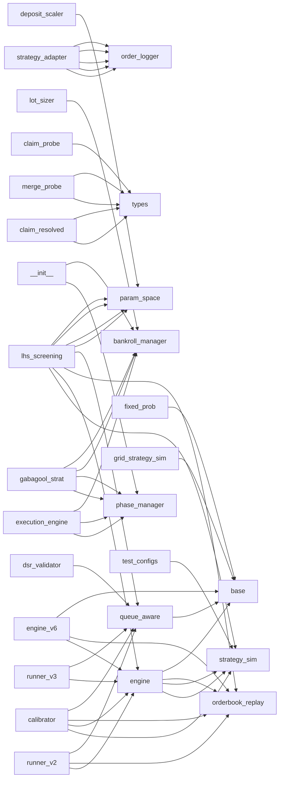

# Import Graph

## Mermaid diagram (top hubs only)

## Forward dependencies (X imports → Y)

### `analysis/core/__init__.py` [UTIL]
- → `tbot_integration/core/bot_selector.py`
- → `tbot_integration/core/epoch_tracker.py`
- → `tbot_integration/core/metrics.py`
- → `tbot_integration/core/parser.py`

### `analysis/core/bot_selector.py` [UTIL]
- → `tbot_integration/core/bot_selector.py`

### `analysis/core/epoch_tracker.py` [UTIL]
- → `tbot_integration/core/epoch_tracker.py`

### `analysis/core/metrics.py` [UTIL]
- → `tbot_integration/core/metrics.py`

### `analysis/core/parser.py` [UTIL]
- → `tbot_integration/core/parser.py`

### `analysis/exports/__init__.py` [UTIL]
- → `analysis/exports/tableau_csv.py`

### `analysis/signals/__init__.py` [UTIL]
- → `analysis/signals/alpha_signals.py`

### `analysis/views/__init__.py` [UTIL]
- → `analysis/views/edge_view.py`
- → `analysis/views/leaderboard.py`
- → `analysis/views/pair_state_view.py`
- → `analysis/views/quoting_health.py`
- → `analysis/views/regime_view.py`
- → `analysis/views/toxic_view.py`

### `analysis/views/toxic_view.py` [TRANSPORT]
- → `analysis/core/metrics.py`

### `backtester/calibration/calibrator.py` [TRANSPORT]
- → `backtester/core/engine.py`
- → `backtester/core/orderbook_replay.py`
- → `backtester/models/queue_aware.py`
- → `backtester/strategy/strategy_sim.py`

### `backtester/configs/market_configs.py` [CORE]
- → `backtester/configs/test_configs.py`

### `backtester/configs/test_configs.py` [PLATFORM]
- → `backtester/strategy/strategy_sim.py`

### `backtester/core/engine.py` [PLATFORM]
- → `backtester/core/orderbook_replay.py`
- → `backtester/models/base.py`
- → `backtester/strategy/strategy_sim.py`

### `backtester/core/engine_v6.py` [PLATFORM]
- → `backtester/core/engine.py`
- → `backtester/core/orderbook_replay.py`
- → `backtester/models/base.py`
- → `backtester/strategy/grid_strategy_sim.py`

### `backtester/daemon/runner_v2.py` [PLATFORM]
- → `backtester/configs/market_configs.py`
- → `backtester/core/engine.py`
- → `backtester/core/orderbook_replay.py`
- → `backtester/models/queue_aware.py`
- → `backtester/reporting/report.py`
- → `backtester/results_db.py`

### `backtester/daemon/runner_v3.py` [PLATFORM]
- → `backtester/configs/market_configs.py`
- → `backtester/configs/test_configs.py`
- → `backtester/core/engine.py`
- → `backtester/models/queue_aware.py`
- → `backtester/reporting/report.py`
- → `backtester/results_db.py`

### `backtester/models/fixed_prob.py` [CORE]
- → `backtester/models/base.py`

### `backtester/models/queue_aware.py` [TRANSPORT]
- → `backtester/models/base.py`

### `backtester/optimizer/deposit_scaler.py` [TRANSPORT]
- → `backtester/optimizer/param_space.py`

### `backtester/optimizer/dsr_validator.py` [TRANSPORT]
- → `backtester/core/engine_v6.py`
- → `backtester/models/queue_aware.py`
- → `backtester/optimizer/lhs_screening.py`
- → `backtester/optimizer/optuna_optimizer.py`
- → `backtester/strategy/grid_strategy_sim.py`

### `backtester/optimizer/lhs_screening.py` [TRANSPORT]
- → `backtester/core/engine.py`
- → `backtester/core/engine_v6.py`
- → `backtester/core/orderbook_replay.py`
- → `backtester/models/queue_aware.py`
- → `backtester/optimizer/optuna_optimizer.py`
- → `backtester/optimizer/param_space.py`
- → `backtester/optimizer/param_space_v6.py`
- → `backtester/optimizer/profiles.py`
- → `backtester/optimizer/profiles_v6.py`
- → `backtester/optimizer/tier_inheritance.py`
- → `backtester/strategy/grid_strategy_sim.py`
- → `backtester/strategy/strategy_sim.py`

### `backtester/optimizer/optuna_optimizer.py` [TRANSPORT]
- → `backtester/core/engine.py`
- → `backtester/core/engine_v6.py`
- → `backtester/core/orderbook_replay.py`
- → `backtester/models/queue_aware.py`
- → `backtester/optimizer/lhs_screening.py`
- → `backtester/optimizer/param_space.py`
- → `backtester/optimizer/param_space_v6.py`
- → `backtester/optimizer/profiles.py`
- → `backtester/optimizer/profiles_v6.py`
- → `backtester/optimizer/tier_inheritance.py`
- → `backtester/reporting/funnel_report.py`

### `backtester/optimizer/param_space.py` [TRANSPORT]
- → `backtester/strategy/strategy_sim.py`

### `backtester/optimizer/param_space_v6.py` [TRANSPORT]
- → `backtester/strategy/grid_strategy_sim.py`

### `backtester/optimizer/profiles.py` [PLATFORM]
- → `backtester/optimizer/param_space.py`

### `backtester/optimizer/profiles_v6.py` [PLATFORM]
- → `backtester/optimizer/profiles_v6_calibrated.py`

### `backtester/optimizer/profiles_v6_calibrated.py` [PLATFORM]
- → `backtester/optimizer/param_space_v6.py`
- → `backtester/optimizer/profiles_v6.py`

### `backtester/optimizer/tier_inheritance.py` [TRANSPORT]
- → `backtester/optimizer/param_space.py`
- → `backtester/optimizer/profiles.py`

### `backtester/reporting/funnel_report.py` [TRANSPORT]
- → `backtester/optimizer/param_space.py`

### `backtester/scripts/hard_mode_autopsy.py` [TRANSPORT]
- → `backtester/core/engine_v6.py`
- → `backtester/core/orderbook_replay.py`
- → `backtester/models/queue_aware.py`
- → `backtester/strategy/grid_strategy_sim.py`

### `backtester/strategy/grid_strategy_sim.py` [PLATFORM]
- → `backtester/core/clock.py`
- → `backtester/models/base.py`
- → `backtester/strategy/order_manager.py`
- → `backtester/strategy/position_tracker.py`
- → `strategies/gabagool/as_pricer.py`
- → `strategies/gabagool/grid_manager.py`
- → `strategies/gabagool/vpin.py`

### `backtester/strategy/order_manager.py` [TRANSPORT]
- → `backtester/models/base.py`

### `backtester/strategy/position_tracker.py` [PLATFORM]
- → `backtester/models/base.py`

### `backtester/strategy/strategy_sim.py` [PLATFORM]
- → `backtester/core/clock.py`
- → `backtester/models/base.py`
- → `backtester/strategy/order_manager.py`
- → `backtester/strategy/position_tracker.py`

### `claim_probe.py` [TRANSPORT]
- → `tbot_core/strategy/types.py`

### `dashboard/microstructure/post_market.py` [CORE]
- → `dashboard/microstructure/calculator.py`
- → `dashboard/microstructure/kde_renderer.py`

### `dashboard/server.py` [PLATFORM]
- → `dashboard/microstructure/post_market.py`
- → `dashboard/microstructure/tape_renderer.py`

### `data_gateway.py` [TRANSPORT]
- → `strategies/gabagool/oracle_engine.py`
- → `tbot_logger/orderbook_logger.py`

### `main.py` [PLATFORM]
- → `strategies/gabagool/oracle_engine.py`
- → `tbot_core/api/client.py`
- → `tbot_core/engine.py`
- → `tbot_integration/live_trading_bridge.py`
- → `tbot_integration/telegram_alerts.py`
- → `tbot_logger/orderbook_logger.py`

### `merge_probe.py` [TRANSPORT]
- → `tbot_core/strategy/types.py`

### `oracle_daemon.py` [TRANSPORT]
- → `strategies/gabagool/oracle_engine.py`

### `replayer.py` [PLATFORM]
- → `strategies/gabagool/execution_engine_v6.py`
- → `strategies/gabagool/grid_strategy.py`

### `run_logger.py` [PLATFORM]
- → `tbot_logger/orderbook_logger.py`

### `scripts/claim_resolved.py` [PLATFORM]
- → `tbot_core/strategy/types.py`

### `scripts/merge_probe.py` [PLATFORM]
- → `tbot_core/strategy/types.py`

### `strategies/gabagool/__init__.py` [UTIL]
- → `strategies/gabagool/as_pricer.py`
- → `strategies/gabagool/bankroll_manager.py`
- → `strategies/gabagool/execution_engine.py`
- → `strategies/gabagool/gabagool_strat.py`
- → `strategies/gabagool/grid_manager.py`
- → `strategies/gabagool/grid_strategy.py`
- → `strategies/gabagool/linked_orders.py`
- → `strategies/gabagool/lot_sizer.py`
- → `strategies/gabagool/opportunity_evaluator.py`
- → `strategies/gabagool/order_pricer.py`
- → `strategies/gabagool/phase_manager.py`
- → `strategies/gabagool/rebalancer.py`
- → `strategies/gabagool/results_tracker.py`
- → `strategies/gabagool/vpin.py`

### `strategies/gabagool/execution_engine.py` [TRANSPORT]
- → `strategies/gabagool/bankroll_manager.py`
- → `strategies/gabagool/lot_sizer.py`
- → `strategies/gabagool/order_pricer.py`
- → `strategies/gabagool/phase_manager.py`

### `strategies/gabagool/execution_engine_v6.py` [PLATFORM]
- → `strategies/gabagool/grid_manager.py`

### `strategies/gabagool/gabagool_strat.py` [PLATFORM]
- → `strategies/gabagool/bankroll_manager.py`
- → `strategies/gabagool/execution_engine.py`
- → `strategies/gabagool/linked_orders.py`
- → `strategies/gabagool/lot_sizer.py`
- → `strategies/gabagool/opportunity_evaluator.py`
- → `strategies/gabagool/order_pricer.py`
- → `strategies/gabagool/phase_manager.py`
- → `strategies/gabagool/price_filter.py`
- → `strategies/gabagool/rebalancer.py`
- → `strategies/gabagool/recovery_module.py`
- → `strategies/gabagool/results_tracker.py`

### `strategies/gabagool/grid_strategy.py` [PLATFORM]
- → `strategies/gabagool/grid_manager.py`
- → `strategies/gabagool/oracle_engine.py`

### `strategies/gabagool/live_trading_bridge.py` [PLATFORM]
- → `tbot_integration/grid_adapter.py`
- → `tbot_integration/strategy_adapter.py`
- → `tbot_integration/strike_fetcher.py`
- → `tbot_integration/telegram_alerts.py`
- → `tbot_logger/orderbook_logger.py`

### `strategies/gabagool/lot_sizer.py` [PLATFORM]
- → `strategies/gabagool/bankroll_manager.py`
- → `strategies/gabagool/phase_manager.py`

### `strategies/gabagool/opportunity_evaluator.py` [PLATFORM]
- → `strategies/gabagool/phase_manager.py`

### `strategies/gabagool/rebalancer.py` [PLATFORM]
- → `strategies/gabagool/bankroll_manager.py`

### `strategies/gabagool/strategy_adapter.py` [PLATFORM]
- → `backtester/bridge/paper_bridge.py`
- → `strategies/gabagool/bankroll_manager.py`
- → `strategies/gabagool/fillrate_logger.py`
- → `strategies/gabagool/order_logger.py`
- → `tbot_core/api/client.py`
- → `tbot_core/api/signing.py`
- → `tbot_core/strategy/order_simulator.py`
- → `tbot_integration/telegram_alerts.py`

### `tbot_core/api/__init__.py` [PLATFORM]
- → `tbot_core/api/client.py`
- → `tbot_core/api/models.py`
- → `tbot_core/api/signing.py`
- → `tbot_core/api/ws_client.py`
- → `tbot_core/api/ws_user_client.py`

### `tbot_core/api/client.py` [PLATFORM]
- → `tbot_core/api/signing.py`

### `tbot_core/engine.py` [PLATFORM]
- → `tbot_core/api/client.py`
- → `tbot_core/api/models.py`
- → `tbot_core/api/ws_client.py`
- → `tbot_core/api/ws_user_client.py`
- → `tbot_core/strategy/core.py`
- → `tbot_risk/guards.py`
- → `tbot_risk/limits.py`

### `tbot_core/strategy/core.py` [PLATFORM]
- → `tbot_core/strategy/types.py`

### `tbot_core/strategy/enhanced_bvmm.py` [PLATFORM]
- → `tbot_core/strategy/core.py`
- → `tbot_core/strategy/log_reader.py`
- → `tbot_core/strategy/order_simulator.py`
- → `tbot_core/strategy/types.py`

### `tbot_core/strategy/order_simulator.py` [CORE]
- → `tbot_core/strategy/types.py`

### `tbot_core/strategy/simple_strat2.py` [TRANSPORT]
- → `tbot_core/strategy/core.py`
- → `tbot_core/strategy/types.py`

### `tbot_integration/core/__init__.py` [UTIL]
- → `analysis/core/bot_selector.py`
- → `analysis/core/epoch_tracker.py`
- → `analysis/core/metrics.py`
- → `analysis/core/parser.py`

### `tbot_integration/core/epoch_tracker.py` [PLATFORM]
- → `analysis/core/parser.py`

### `tbot_integration/core/metrics.py` [CORE]
- → `analysis/core/epoch_tracker.py`
- → `analysis/core/parser.py`

### `tbot_integration/grid_adapter.py` [PLATFORM]
- → `backtester/models/base.py`
- → `backtester/models/queue_aware.py`
- → `strategies/gabagool/execution_engine_v6.py`
- → `strategies/gabagool/grid_manager.py`
- → `strategies/gabagool/grid_strategy.py`
- → `tbot_core/strategy/types.py`
- → `tbot_integration/strike_fetcher.py`

### `tbot_integration/live_trading_bridge.py` [PLATFORM]
- → `tbot_integration/grid_adapter.py`
- → `tbot_integration/strategy_adapter.py`
- → `tbot_integration/strike_fetcher.py`
- → `tbot_integration/telegram_alerts.py`
- → `tbot_logger/orderbook_logger.py`

### `tbot_integration/strategy_adapter.py` [PLATFORM]
- → `backtester/bridge/paper_bridge.py`
- → `strategies/gabagool/bankroll_manager.py`
- → `strategies/gabagool/fillrate_logger.py`
- → `strategies/gabagool/grid_strategy.py`
- → `strategies/gabagool/order_logger.py`
- → `tbot_core/api/client.py`
- → `tbot_core/api/signing.py`
- → `tbot_core/strategy/order_simulator.py`
- → `tbot_integration/telegram_alerts.py`

### `tbot_logger/orderbook_logger.py` [PLATFORM]
- → `tbot_logger/enhanced_logger.py`
- → `tbot_logger/poly_orderbook_swarm.py`

## Reverse dependencies (X is imported by → Y)

### `backtester/optimizer/param_space.py` [TRANSPORT] — imported by 13 files
- ← `backtester/optimizer/deposit_scaler.py`
- ← `backtester/optimizer/lhs_screening.py`
- ← `backtester/optimizer/optuna_optimizer.py`
- ← `backtester/optimizer/profiles.py`
- ← `backtester/optimizer/tier_inheritance.py`
- ← `backtester/reporting/funnel_report.py`

### `strategies/gabagool/order_logger.py` [PLATFORM] — imported by 12 files
- ← `strategies/gabagool/strategy_adapter.py`
- ← `tbot_integration/strategy_adapter.py`

### `strategies/gabagool/bankroll_manager.py` [PLATFORM] — imported by 11 files
- ← `strategies/gabagool/__init__.py`
- ← `strategies/gabagool/execution_engine.py`
- ← `strategies/gabagool/gabagool_strat.py`
- ← `strategies/gabagool/lot_sizer.py`
- ← `strategies/gabagool/rebalancer.py`
- ← `strategies/gabagool/strategy_adapter.py`
- ← `tbot_integration/strategy_adapter.py`

### `tbot_core/strategy/types.py` [PLATFORM] — imported by 10 files
- ← `claim_probe.py`
- ← `merge_probe.py`
- ← `scripts/claim_resolved.py`
- ← `scripts/merge_probe.py`
- ← `tbot_core/strategy/core.py`
- ← `tbot_core/strategy/enhanced_bvmm.py`
- ← `tbot_core/strategy/order_simulator.py`
- ← `tbot_core/strategy/simple_strat2.py`
- ← `tbot_integration/grid_adapter.py`

### `backtester/models/base.py` [CORE] — imported by 9 files
- ← `backtester/core/engine.py`
- ← `backtester/core/engine_v6.py`
- ← `backtester/models/fixed_prob.py`
- ← `backtester/models/queue_aware.py`
- ← `backtester/strategy/grid_strategy_sim.py`
- ← `backtester/strategy/order_manager.py`
- ← `backtester/strategy/position_tracker.py`
- ← `backtester/strategy/strategy_sim.py`
- ← `tbot_integration/grid_adapter.py`

### `strategies/gabagool/phase_manager.py` [PLATFORM] — imported by 9 files
- ← `strategies/gabagool/__init__.py`
- ← `strategies/gabagool/execution_engine.py`
- ← `strategies/gabagool/gabagool_strat.py`
- ← `strategies/gabagool/lot_sizer.py`
- ← `strategies/gabagool/opportunity_evaluator.py`

### `backtester/models/queue_aware.py` [TRANSPORT] — imported by 8 files
- ← `backtester/calibration/calibrator.py`
- ← `backtester/daemon/runner_v2.py`
- ← `backtester/daemon/runner_v3.py`
- ← `backtester/optimizer/dsr_validator.py`
- ← `backtester/optimizer/lhs_screening.py`
- ← `backtester/optimizer/optuna_optimizer.py`
- ← `backtester/scripts/hard_mode_autopsy.py`
- ← `tbot_integration/grid_adapter.py`

### `backtester/core/orderbook_replay.py` [TRANSPORT] — imported by 7 files
- ← `backtester/calibration/calibrator.py`
- ← `backtester/core/engine.py`
- ← `backtester/core/engine_v6.py`
- ← `backtester/daemon/runner_v2.py`
- ← `backtester/optimizer/lhs_screening.py`
- ← `backtester/optimizer/optuna_optimizer.py`
- ← `backtester/scripts/hard_mode_autopsy.py`

### `backtester/core/engine.py` [PLATFORM] — imported by 6 files
- ← `backtester/calibration/calibrator.py`
- ← `backtester/core/engine_v6.py`
- ← `backtester/daemon/runner_v2.py`
- ← `backtester/daemon/runner_v3.py`
- ← `backtester/optimizer/lhs_screening.py`
- ← `backtester/optimizer/optuna_optimizer.py`

### `backtester/strategy/strategy_sim.py` [PLATFORM] — imported by 6 files
- ← `backtester/calibration/calibrator.py`
- ← `backtester/configs/test_configs.py`
- ← `backtester/core/engine.py`
- ← `backtester/optimizer/lhs_screening.py`
- ← `backtester/optimizer/param_space.py`

### `strategies/gabagool/grid_strategy.py` [PLATFORM] — imported by 6 files
- ← `replayer.py`
- ← `strategies/gabagool/__init__.py`
- ← `tbot_integration/grid_adapter.py`
- ← `tbot_integration/strategy_adapter.py`

### `strategies/gabagool/order_pricer.py` [TRANSPORT] — imported by 6 files
- ← `strategies/gabagool/__init__.py`
- ← `strategies/gabagool/execution_engine.py`
- ← `strategies/gabagool/gabagool_strat.py`

### `backtester/strategy/grid_strategy_sim.py` [PLATFORM] — imported by 5 files
- ← `backtester/core/engine_v6.py`
- ← `backtester/optimizer/dsr_validator.py`
- ← `backtester/optimizer/lhs_screening.py`
- ← `backtester/optimizer/param_space_v6.py`
- ← `backtester/scripts/hard_mode_autopsy.py`

### `backtester/optimizer/param_space_v6.py` [TRANSPORT] — imported by 5 files
- ← `backtester/optimizer/lhs_screening.py`
- ← `backtester/optimizer/optuna_optimizer.py`
- ← `backtester/optimizer/profiles_v6_calibrated.py`

### `strategies/gabagool/grid_manager.py` [PLATFORM] — imported by 5 files
- ← `backtester/strategy/grid_strategy_sim.py`
- ← `strategies/gabagool/__init__.py`
- ← `strategies/gabagool/execution_engine_v6.py`
- ← `strategies/gabagool/grid_strategy.py`
- ← `tbot_integration/grid_adapter.py`

### `strategies/gabagool/oracle_engine.py` [TRANSPORT] — imported by 5 files
- ← `data_gateway.py`
- ← `main.py`
- ← `oracle_daemon.py`
- ← `strategies/gabagool/grid_strategy.py`

### `tbot_logger/orderbook_logger.py` [PLATFORM] — imported by 5 files
- ← `data_gateway.py`
- ← `main.py`
- ← `run_logger.py`
- ← `strategies/gabagool/live_trading_bridge.py`
- ← `tbot_integration/live_trading_bridge.py`

### `tbot_core/api/client.py` [PLATFORM] — imported by 5 files
- ← `main.py`
- ← `strategies/gabagool/strategy_adapter.py`
- ← `tbot_core/api/__init__.py`
- ← `tbot_core/engine.py`
- ← `tbot_integration/strategy_adapter.py`

### `tbot_integration/telegram_alerts.py` [TRANSPORT] — imported by 5 files
- ← `main.py`
- ← `strategies/gabagool/live_trading_bridge.py`
- ← `strategies/gabagool/strategy_adapter.py`
- ← `tbot_integration/live_trading_bridge.py`
- ← `tbot_integration/strategy_adapter.py`

### `strategies/gabagool/lot_sizer.py` [PLATFORM] — imported by 5 files
- ← `strategies/gabagool/__init__.py`
- ← `strategies/gabagool/execution_engine.py`
- ← `strategies/gabagool/gabagool_strat.py`

### `backtester/core/engine_v6.py` [PLATFORM] — imported by 4 files
- ← `backtester/optimizer/dsr_validator.py`
- ← `backtester/optimizer/lhs_screening.py`
- ← `backtester/optimizer/optuna_optimizer.py`
- ← `backtester/scripts/hard_mode_autopsy.py`

### `tbot_core/api/signing.py` [PLATFORM] — imported by 4 files
- ← `strategies/gabagool/strategy_adapter.py`
- ← `tbot_core/api/__init__.py`
- ← `tbot_core/api/client.py`
- ← `tbot_integration/strategy_adapter.py`

### `tbot_integration/core/parser.py` [PLATFORM] — imported by 3 files
- ← `analysis/core/__init__.py`
- ← `analysis/core/parser.py`

### `tbot_integration/core/epoch_tracker.py` [PLATFORM] — imported by 3 files
- ← `analysis/core/__init__.py`
- ← `analysis/core/epoch_tracker.py`

### `tbot_integration/core/metrics.py` [CORE] — imported by 3 files
- ← `analysis/core/__init__.py`
- ← `analysis/core/metrics.py`

### `tbot_integration/core/bot_selector.py` [CORE] — imported by 3 files
- ← `analysis/core/__init__.py`
- ← `analysis/core/bot_selector.py`

### `backtester/optimizer/lhs_screening.py` [TRANSPORT] — imported by 3 files
- ← `backtester/optimizer/dsr_validator.py`
- ← `backtester/optimizer/optuna_optimizer.py`

### `backtester/optimizer/profiles_v6.py` [PLATFORM] — imported by 3 files
- ← `backtester/optimizer/lhs_screening.py`
- ← `backtester/optimizer/optuna_optimizer.py`
- ← `backtester/optimizer/profiles_v6_calibrated.py`

### `backtester/optimizer/profiles.py` [PLATFORM] — imported by 3 files
- ← `backtester/optimizer/lhs_screening.py`
- ← `backtester/optimizer/optuna_optimizer.py`
- ← `backtester/optimizer/tier_inheritance.py`

### `strategies/gabagool/opportunity_evaluator.py` [PLATFORM] — imported by 3 files
- ← `strategies/gabagool/__init__.py`
- ← `strategies/gabagool/gabagool_strat.py`

### `strategies/gabagool/execution_engine.py` [TRANSPORT] — imported by 3 files
- ← `strategies/gabagool/__init__.py`
- ← `strategies/gabagool/gabagool_strat.py`

### `strategies/gabagool/results_tracker.py` [PLATFORM] — imported by 3 files
- ← `strategies/gabagool/__init__.py`
- ← `strategies/gabagool/gabagool_strat.py`

### `strategies/gabagool/rebalancer.py` [PLATFORM] — imported by 3 files
- ← `strategies/gabagool/__init__.py`
- ← `strategies/gabagool/gabagool_strat.py`

### `strategies/gabagool/linked_orders.py` [TRANSPORT] — imported by 3 files
- ← `strategies/gabagool/__init__.py`
- ← `strategies/gabagool/gabagool_strat.py`

### `tbot_integration/strike_fetcher.py` [TRANSPORT] — imported by 3 files
- ← `strategies/gabagool/live_trading_bridge.py`
- ← `tbot_integration/grid_adapter.py`
- ← `tbot_integration/live_trading_bridge.py`

### `tbot_core/strategy/order_simulator.py` [CORE] — imported by 3 files
- ← `strategies/gabagool/strategy_adapter.py`
- ← `tbot_core/strategy/enhanced_bvmm.py`
- ← `tbot_integration/strategy_adapter.py`

### `tbot_core/api/models.py` [PLATFORM] — imported by 3 files
- ← `tbot_core/api/__init__.py`
- ← `tbot_core/engine.py`

### `tbot_core/strategy/core.py` [PLATFORM] — imported by 3 files
- ← `tbot_core/engine.py`
- ← `tbot_core/strategy/enhanced_bvmm.py`
- ← `tbot_core/strategy/simple_strat2.py`

### `analysis/core/parser.py` [UTIL] — imported by 3 files
- ← `tbot_integration/core/__init__.py`
- ← `tbot_integration/core/epoch_tracker.py`
- ← `tbot_integration/core/metrics.py`

### `analysis/core/metrics.py` [UTIL] — imported by 2 files
- ← `analysis/views/toxic_view.py`
- ← `tbot_integration/core/__init__.py`

### `backtester/configs/test_configs.py` [PLATFORM] — imported by 2 files
- ← `backtester/configs/market_configs.py`
- ← `backtester/daemon/runner_v3.py`

### `backtester/configs/market_configs.py` [CORE] — imported by 2 files
- ← `backtester/daemon/runner_v2.py`
- ← `backtester/daemon/runner_v3.py`

### `backtester/reporting/report.py` [TRANSPORT] — imported by 2 files
- ← `backtester/daemon/runner_v2.py`
- ← `backtester/daemon/runner_v3.py`

### `backtester/results_db.py` [PLATFORM] — imported by 2 files
- ← `backtester/daemon/runner_v2.py`
- ← `backtester/daemon/runner_v3.py`

### `backtester/optimizer/optuna_optimizer.py` [TRANSPORT] — imported by 2 files
- ← `backtester/optimizer/dsr_validator.py`
- ← `backtester/optimizer/lhs_screening.py`

### `backtester/optimizer/tier_inheritance.py` [TRANSPORT] — imported by 2 files
- ← `backtester/optimizer/lhs_screening.py`
- ← `backtester/optimizer/optuna_optimizer.py`

### `backtester/strategy/order_manager.py` [TRANSPORT] — imported by 2 files
- ← `backtester/strategy/grid_strategy_sim.py`
- ← `backtester/strategy/strategy_sim.py`

### `backtester/strategy/position_tracker.py` [PLATFORM] — imported by 2 files
- ← `backtester/strategy/grid_strategy_sim.py`
- ← `backtester/strategy/strategy_sim.py`

### `backtester/core/clock.py` [CORE] — imported by 2 files
- ← `backtester/strategy/grid_strategy_sim.py`
- ← `backtester/strategy/strategy_sim.py`

### `strategies/gabagool/as_pricer.py` [PLATFORM] — imported by 2 files
- ← `backtester/strategy/grid_strategy_sim.py`
- ← `strategies/gabagool/__init__.py`

### `strategies/gabagool/vpin.py` [TRANSPORT] — imported by 2 files
- ← `backtester/strategy/grid_strategy_sim.py`
- ← `strategies/gabagool/__init__.py`

### `dashboard/microstructure/tape_renderer.py` [PLATFORM] — imported by 2 files
- ← `dashboard/server.py`

### `tbot_integration/live_trading_bridge.py` [PLATFORM] — imported by 2 files
- ← `main.py`

### `strategies/gabagool/execution_engine_v6.py` [PLATFORM] — imported by 2 files
- ← `replayer.py`
- ← `tbot_integration/grid_adapter.py`

### `strategies/gabagool/price_filter.py` [PLATFORM] — imported by 2 files
- ← `strategies/gabagool/gabagool_strat.py`

### `strategies/gabagool/recovery_module.py` [PLATFORM] — imported by 2 files
- ← `strategies/gabagool/gabagool_strat.py`

### `tbot_integration/strategy_adapter.py` [PLATFORM] — imported by 2 files
- ← `strategies/gabagool/live_trading_bridge.py`
- ← `tbot_integration/live_trading_bridge.py`

### `tbot_integration/grid_adapter.py` [PLATFORM] — imported by 2 files
- ← `strategies/gabagool/live_trading_bridge.py`
- ← `tbot_integration/live_trading_bridge.py`

### `strategies/gabagool/fillrate_logger.py` [PLATFORM] — imported by 2 files
- ← `strategies/gabagool/strategy_adapter.py`
- ← `tbot_integration/strategy_adapter.py`

### `backtester/bridge/paper_bridge.py` [TRANSPORT] — imported by 2 files
- ← `strategies/gabagool/strategy_adapter.py`
- ← `tbot_integration/strategy_adapter.py`

### `tbot_core/api/ws_client.py` [PLATFORM] — imported by 2 files
- ← `tbot_core/api/__init__.py`
- ← `tbot_core/engine.py`

### `tbot_core/api/ws_user_client.py` [PLATFORM] — imported by 2 files
- ← `tbot_core/api/__init__.py`
- ← `tbot_core/engine.py`

### `analysis/core/epoch_tracker.py` [UTIL] — imported by 2 files
- ← `tbot_integration/core/__init__.py`
- ← `tbot_integration/core/metrics.py`

### `analysis/exports/tableau_csv.py` [CORE] — imported by 1 files
- ← `analysis/exports/__init__.py`

### `analysis/signals/alpha_signals.py` [PLATFORM] — imported by 1 files
- ← `analysis/signals/__init__.py`

### `analysis/views/leaderboard.py` [TRANSPORT] — imported by 1 files
- ← `analysis/views/__init__.py`

### `analysis/views/regime_view.py` [TRANSPORT] — imported by 1 files
- ← `analysis/views/__init__.py`

### `analysis/views/toxic_view.py` [TRANSPORT] — imported by 1 files
- ← `analysis/views/__init__.py`

### `analysis/views/edge_view.py` [TRANSPORT] — imported by 1 files
- ← `analysis/views/__init__.py`

### `analysis/views/pair_state_view.py` [TRANSPORT] — imported by 1 files
- ← `analysis/views/__init__.py`

### `analysis/views/quoting_health.py` [TRANSPORT] — imported by 1 files
- ← `analysis/views/__init__.py`

### `backtester/reporting/funnel_report.py` [TRANSPORT] — imported by 1 files
- ← `backtester/optimizer/optuna_optimizer.py`

### `backtester/optimizer/profiles_v6_calibrated.py` [PLATFORM] — imported by 1 files
- ← `backtester/optimizer/profiles_v6.py`

### `dashboard/microstructure/calculator.py` [TRANSPORT] — imported by 1 files
- ← `dashboard/microstructure/post_market.py`

### `dashboard/microstructure/kde_renderer.py` [TRANSPORT] — imported by 1 files
- ← `dashboard/microstructure/post_market.py`

### `dashboard/microstructure/post_market.py` [CORE] — imported by 1 files
- ← `dashboard/server.py`

### `tbot_core/engine.py` [PLATFORM] — imported by 1 files
- ← `main.py`

### `strategies/gabagool/gabagool_strat.py` [PLATFORM] — imported by 1 files
- ← `strategies/gabagool/__init__.py`

### `tbot_risk/guards.py` [PLATFORM] — imported by 1 files
- ← `tbot_core/engine.py`

### `tbot_risk/limits.py` [TRANSPORT] — imported by 1 files
- ← `tbot_core/engine.py`

### `tbot_core/strategy/log_reader.py` [PLATFORM] — imported by 1 files
- ← `tbot_core/strategy/enhanced_bvmm.py`

### `analysis/core/bot_selector.py` [UTIL] — imported by 1 files
- ← `tbot_integration/core/__init__.py`

### `tbot_logger/poly_orderbook_swarm.py` [TRANSPORT] — imported by 1 files
- ← `tbot_logger/orderbook_logger.py`

### `tbot_logger/enhanced_logger.py` [TRANSPORT] — imported by 1 files
- ← `tbot_logger/orderbook_logger.py`
